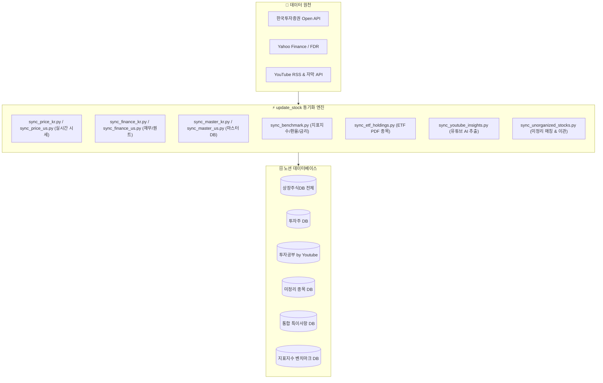

# 📦 update_stock: 금융 데이터 수집 & 정제 허브 (ETL Engine)

> **한국/미국 주식 시세, 재무제표, 퀀트 팩터, ETF 구성종목(PDF), 거시 지표지수, 유튜브 AI 시황을 자동 수집하여 노션(Notion) 데이터베이스와 100% 실시간 동기화하는 자동화 엔진입니다.**

---

## 🏗️ 1. 전체 아키텍처 및 1:1 대칭 매핑

모든 데이터 수집/정제 스크립트는 **`sync_[대상]_[국가/유형]`** 표준 명명 규칙을 따르며, GitHub Actions 워크플로우와 **1:1 완벽 대칭 구조**를 이룹니다.

---

## 🗂️ 2. 파이썬 스크립트(`.py`) & 워크플로우(`.yml`) 상세 설명

| 번호 | 파이썬 스크립트 | GitHub Actions 워크플로우 | cron-job.org Event | 주요 수집 데이터 및 역할 |
|:---:|:---|:---|:---|:---|
| **1** | [`sync_price_kr.py`](file:///d:/Github%20IDE/update_stock/sync_price_kr.py) | [`sync_price_kr.yml`](file:///d:/Github%20IDE/update_stock/.github/workflows/sync_price_kr.yml) | `kr_price_update`, `kr_update` | 한투 API 기반 국내 주식/ETF 실시간 현재가, 전일대비, 거래량 갱신 |
| **2** | [`sync_price_us.py`](file:///d:/Github%20IDE/update_stock/sync_price_us.py) | [`sync_price_us.yml`](file:///d:/Github%20IDE/update_stock/.github/workflows/sync_price_us.yml) | `us_price_update`, `us_update` | Yahoo Finance 기반 미국 주식/ETF 종가, 52주 고저가, 등락률 갱신 |
| **3** | [`sync_finance_kr.py`](file:///d:/Github%20IDE/update_stock/sync_finance_kr.py) | [`sync_finance_kr.yml`](file:///d:/Github%20IDE/update_stock/.github/workflows/sync_finance_kr.yml) | `kr_finance_update`, `kr_finance` | 국내 기업 PER, PBR, ROE, 배당수익률, 5대 퀀트팩터 산출 및 적재 |
| **4** | [`sync_finance_us.py`](file:///d:/Github%20IDE/update_stock/sync_finance_us.py) | [`sync_finance_us.yml`](file:///d:/Github%20IDE/update_stock/.github/workflows/sync_finance_us.yml) | `us_finance_update`, `us_finance` | 미국 기업 밸류에이션, 배당률, 영업이익률, 퀀트 점수 산출 및 적재 |
| **5** | [`sync_master_kr.py`](file:///d:/Github%20IDE/update_stock/sync_master_kr.py) | [`sync_master_kr.yml`](file:///d:/Github%20IDE/update_stock/.github/workflows/sync_master_kr.yml) | `kr_master_sync` | 한국 거래소(KRX) 코스피/코스닥/ETF 전종목 마스터 DB 동기화 |
| **6** | [`sync_master_us.py`](file:///d:/Github%20IDE/update_stock/sync_master_us.py) | [`sync_master_us.yml`](file:///d:/Github%20IDE/update_stock/.github/workflows/sync_master_us.yml) | `us_master_sync` | 미국 S&P500, NASDAQ, 주요 글로벌 ETF 마스터 DB 동기화 |
| **7** | [`sync_benchmark.py`](file:///d:/Github%20IDE/update_stock/sync_benchmark.py) | [`sync_benchmark.yml`](file:///d:/Github%20IDE/update_stock/.github/workflows/sync_benchmark.yml) | `benchmark_sync` | 주요 거시 지표(USD/KRW, 미국10년물, WTI유가, 금선물 등 54종) 동기화 |
| **8** | [`sync_etf_holdings.py`](file:///d:/Github%20IDE/update_stock/sync_etf_holdings.py) | [`sync_etf_holdings.yml`](file:///d:/Github%20IDE/update_stock/.github/workflows/sync_etf_holdings.yml) | `kr_etf_update`, `update_etf_holdings` | 국내 상장 주요 ETF 구성종목(PDF) 및 비중 데이터 추출/갱신 |
| **9** | [`sync_youtube_insights.py`](file:///d:/Github%20IDE/update_stock/sync_youtube_insights.py) | [`sync_youtube_insights.yml`](file:///d:/Github%20IDE/update_stock/.github/workflows/sync_youtube_insights.yml) | `youtube_sync`, `sync_youtube_insights` | 유튜브 RSS $\rightarrow$ 자막 추출 $\rightarrow$ Gemini Pydantic AI 분석 $\rightarrow$ 노션 적재 |
| **10** | [`sync_unorganized_stocks.py`](file:///d:/Github%20IDE/update_stock/sync_unorganized_stocks.py) | [`sync_unorganized_stocks.yml`](file:///d:/Github%20IDE/update_stock/.github/workflows/sync_unorganized_stocks.yml) | `daily_matcher`, `sync_unorganized_stocks` | 미정리 종목 환율 갱신 $\rightarrow$ 마스터 매칭 $\rightarrow$ '정리' 시 특이사항 이관 |

---

## 🧠 3. 공통 모듈 및 프롬프트 관리자

- **[`prompt_manager.py`](file:///d:/Github%20IDE/update_stock/prompt_manager.py)**: `prompts/*.en.md`에서 영문 시스템 프롬프트를 마이크로초 단위로 캐싱 로드하는 중앙 허브.
- **[`ai_service.py`](file:///d:/Github%20IDE/update_stock/ai_service.py)**: Google GenAI 최신 SDK 기반 Pydantic Structured Outputs (`YouTubeAnalysisResult`) 엔진.
- **[`notion_utils.py`](file:///d:/Github%20IDE/update_stock/notion_utils.py)**: 노션 API 통신, 지수 백오프 재시도, 스키마 방어 로직(`if field in props`) 유틸리티.
- **[`sync_manager.py`](file:///d:/Github%20IDE/update_stock/sync_manager.py)**: 회사 PC와 집 PC 간 Git Pull/Push 원클릭 동기화 매니저.
- **[`1_작업시작_동기화.bat`](file:///d:/Github%20IDE/update_stock/1_%EC%9E%91%EC%97%85%EC%8B%9C%EC%9E%91_%EB%8F%99%EA%B8%B0%ED%99%94.bat)** / **[`3_작업종료_동기화.bat`](file:///d:/Github%20IDE/update_stock/3_%EC%9E%91%EC%97%85%EC%A2%85%EB%A3%8C_%EB%8F%99%EA%B8%B0%ED%99%94.bat)**: 원클릭 동기화 배치.

---

## ⏰ 4. [유지보수 표준 운영 절차 (Maintenance SOP)]

안정적인 자동 수집 및 무장애 운영을 위한 주기별 점검 과제:

### 🌞 1) 일간 과제 (Daily Checklist)
- [ ] **유튜브 AI 수집 확인 (`sync_youtube_insights.py`)**:
  - 매일 18:30 이후 `투자공부 by Youtube` DB에 신규 영상 요약 페이지가 정상 생성되었는지 확인.
- [ ] **미정리 종목 검토 및 이관 (`sync_unorganized_stocks.py`)**:
  - `미정리 종목` DB에서 내용을 검토한 후 **`정리` 체크박스(V)**를 눌러 `통합 특이사항 DB`로 이관 및 원본 삭제.

### 📅 2) 주간 과제 (Weekly Checklist)
- [ ] **GitHub Actions 실행 로그 확인**:
  - Actions 탭에서 10개 워크플로우가 실패 없이 녹색(Success)을 유지하는지 확인.
- [ ] **KIS API 토큰 캐시 유효성 점검**:
  - `.kis_token_cache.json` 24시간 재사용 캐시가 정상 작동하는지 확인.

### 🗓️ 3) 월간 과제 (Monthly Checklist)
- [ ] **상장폐지 및 신규 상장 종목 동기화 (`sync_master_kr.py`, `sync_master_us.py`)**:
  - 마스터 DB 전체 수동 실행(`workflow_dispatch` -> `IS_FULL_UPDATE=true`)으로 누락 종목 갱신.
- [ ] **지표지수 헬스체크 (`sync_benchmark.py`)**:
  - 54개 벤치마크 지표의 매칭률이 75% 이상 유지되는지 점검.

### 🏛️ 4) 분기 및 연간 과제 (Quarterly / Yearly Checklist)
- [ ] **한국투자증권 API Key 유효기간 갱신**:
  - KIS 실전 App Key/Secret은 1년 단위로 만료되므로 갱신 후 GitHub Secrets 및 `.env` 업데이트.
- [ ] **Gemini AI 모델 버전 점검**:
  - 신규 Gemini 모델 출시 시 `prompts/` 영문 템플릿 미세 조정 후 테스트 실행.
