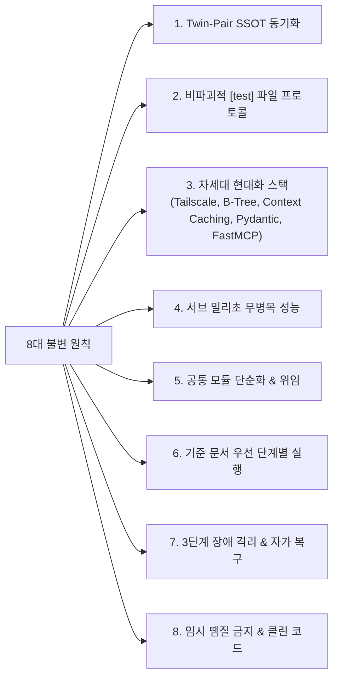
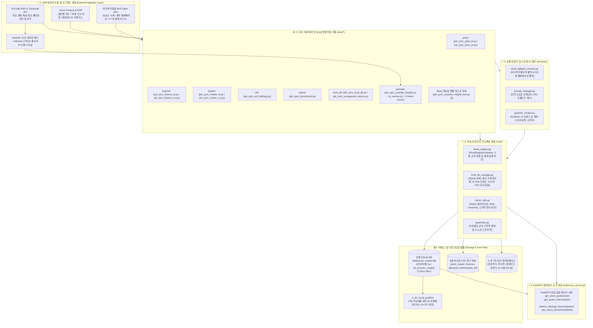
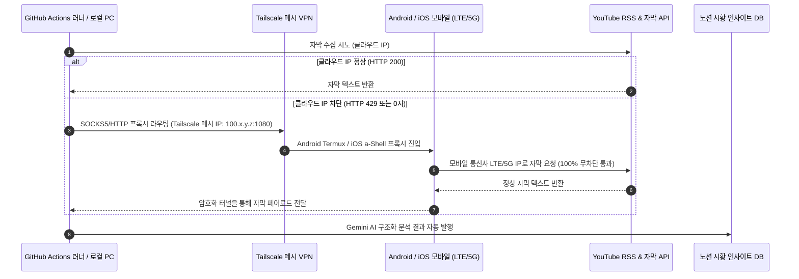
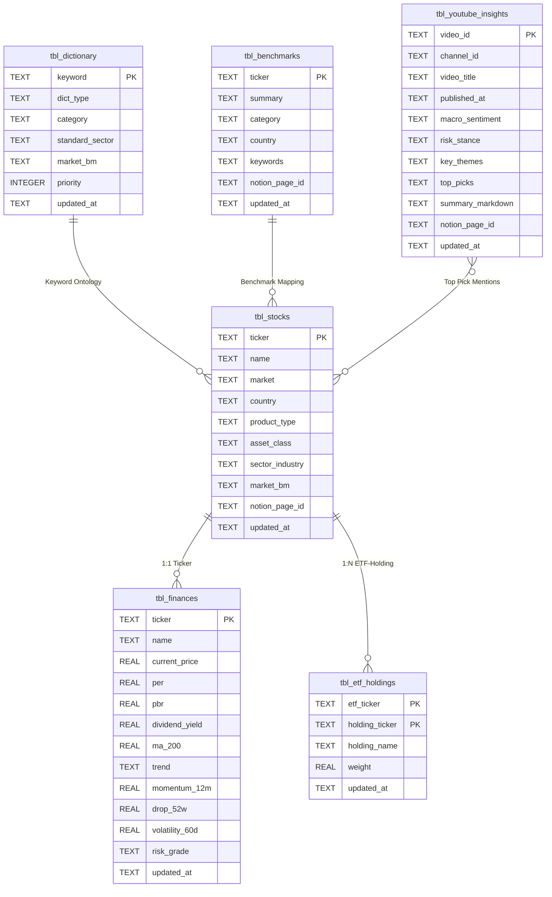
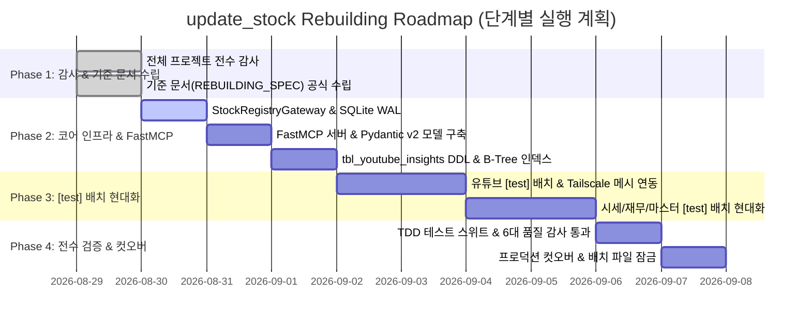

# 🏗️ [update_stock] 금융 데이터 수집/정제 서브 엔진 리빌딩 공식 명세서 (REBUILDING_SPEC.ko.md)

<!--
# 🏗️ [update_stock] Market Data ETL Sub-Engine Rebuilding Specification (Korean Edition)
-->

> **문서 버전**: 3.0.0 (엔터프라이즈 아키텍처 전면 개편 표준)  
> **대상 서브시스템**: `update_stock` (금융 데이터 수집/정제, 종목 마스터 및 인텔리전스 서브 엔진)  
> **트윈 시스템**: [`k_all_round_portfolio`](file:///d:/Github%20IDE/k_all_round_portfolio) (패밀리오피스 퀀트 CIO 및 포트폴리오 BI)  
> **영문 원본 명세서**: [`REBUILDING_SPEC.md`](file:///d:/Github%20IDE/update_stock/REBUILDING_SPEC.md)  
> **참조 표준**: [`GEMINI.md`](file:///d:/Github%20IDE/update_stock/GEMINI.md) (도메인 룰), [`AGENT.md`](file:///d:/Github%20IDE/update_stock/AGENT.md) (엔지니어링 표준), [`AUDIT_CHECKLIST.md`](file:///d:/Github%20IDE/update_stock/AUDIT_CHECKLIST.md) (품질 감사 기준), [`SYSTEM_MAP.md`](file:///d:/Github%20IDE/update_stock/docs/SYSTEM_MAP.md) (통합 아키텍처 맵)

---

> [!IMPORTANT]
> **엔지니어링 불변 원칙 및 리빌딩 거버넌스**:
> 1. **비파괴적 병렬 테스트 파일 프로토콜 (Non-Destructive `[test]` Protocol)**: 실험 및 개발 단계에서 기존 운영 코드를 절대 직접 수정하지 않음. 모든 신규/개편 컴포넌트는 `[test]` 또는 `_test.py` 식별자가 포함된 독립 병렬 테스트 파일(예: `job_sync_youtube_insights_test.py`, `[test]_job_sync_price_kr.py`)로 작성하여 운영 무중단을 100% 보장함.
> 2. **최신 고도화 아키텍처 스택 (Next-Gen Tech Stack)**:
>    - **Android Tailscale LTE/5G 모바일 메시**: iOS 단축어와 함께 통신사 IP 기반 안티봇 프록시 터널링 완비.
>    - **SQLite B-Tree 인덱스 기반 `tbl_youtube_insights`**: 고속 조회를 위한 6번째 영구 관계형 캐시 테이블 증설.
>    - **Google Gemini Context Caching**: 정적 프롬프트 및 온톨로지 캐싱을 통해 토큰 비용 $>75\%$ 및 지연 시간 $>85\%$ 절감.
>    - **Pydantic v2 Structured Output**: 결정론적 JSON 스키마 유효성 검증 모델 구축.
>    - **FastMCP (Model Context Protocol)**: AI 에이전트 도구 연동을 위한 표준 서버 구축.
> 3. **서브 밀리초 무병목 성능 원칙 (Sub-Millisecond Zero-Bottleneck)**: 모든 I/O 경로와 쿼리를 점검하여 무거운 웹 스크래핑을 배제하고 인메모리 순수 해석기, SQLite WAL 인덱스 스캔($<1\text{ms}$), Dirty Checking 사전 필터링을 강제함.
> 4. **공통 모듈 방식 기반 코드 단순화**: 공통 인프라([`core/stock_registry.py`](file:///d:/Github%20IDE/update_stock/core/stock_registry.py), [`core/local_db_manager.py`](file:///d:/Github%20IDE/update_stock/core/local_db_manager.py), [`core/notion_utils.py`](file:///d:/Github%20IDE/update_stock/core/notion_utils.py), [`core/guardrails.py`](file:///d:/Github%20IDE/update_stock/core/guardrails.py), [`services/stock_fallback_resolver.py`](file:///d:/Github%20IDE/update_stock/services/stock_fallback_resolver.py)) 위임 패턴을 철저히 준수함.
> 5. **기준 문서 수립 우선 원칙 (Spec-First Engineering)**: *전체 워크스페이스 감사 $\rightarrow$ 기준 문서([`REBUILDING_SPEC.md`](file:///d:/Github%20IDE/update_stock/REBUILDING_SPEC.md), [`GEMINI.md`](file:///d:/Github%20IDE/update_stock/GEMINI.md), [`AGENT.md`](file:///d:/Github%20IDE/update_stock/AGENT.md)) 수정/수립 $\rightarrow$ `[test]` 코드 작성 $\rightarrow$ TDD 검증 $\rightarrow$ 프로덕션 컷오버* 순으로 일관성 있게 진행함.
> 6. **기관형 명사형 종결어미 엄격 준수**: 모든 분석, 진단 및 리포트 문장은 `~함`, `~임`, `~필요`, `~권고`로 명확히 종결함.

---

## 📑 목차 (Table of Contents)

1. [🏛️ 1. 리빌딩 비전 및 8대 핵심 아키텍처 불변 원칙](#1-리빌딩-비전-및-8대-핵심-아키텍처-불변-원칙)
2. [🗺️ 2. 시스템 목표 계층 구조 및 엔드투엔드 데이터 흐름도](#2-시스템-목표-계층-구조-및-엔드투엔드-데이터-흐름도)
3. [📂 3. 디렉터리 레이아웃 및 Job-Centric 응집도 표준](#3-디렉터리-레이아웃-및-job-centric-응집도-표준)
4. [🚀 4. 차세대 현대화 4대 핵심 서브시스템 상세 명세](#4-차세대-현대화-4대-핵심-서브시스템-상세-명세)
   - [4.1. Android Tailscale LTE/5G 모바일 안티봇 메시](#41-android-tailscale-lte5g-모바일-안티봇-메시)
   - [4.2. SQLite B-Tree 기반 `tbl_youtube_insights` 스키마](#42-sqlite-b-tree-기반-tbl_youtube_insights-스키마)
   - [4.3. Gemini Context Caching & Pydantic v2 구조화 출력](#43-gemini-context-caching--pydantic-v2-구조화-출력)
   - [4.4. FastMCP 서버 표준화 (`tools/mcp_server.py`)](#44-fastmcp-서버-표준화-toolsmcp_serverpy)
5. [⚙️ 5. 11대 대칭형 자율 배치 워크플로우 상세 명세](#5-11대-대칭형-자율-배치-워크플로우-상세-명세)
6. [🧠 6. 핵심 인프라 4대 모듈 및 단순화 명세 (`core/`)](#6-핵심-인프라-4대-모듈-및-단순화-명세-core)
7. [🔌 7. 다중 도메인 공통 어댑터 서비스 명세 (`services/`)](#7-다중-도메인-공통-어댑터-서비스-명세-services)
8. [🗄️ 8. 로컬 SQLite DB (6대 테이블) & 정규화 CSV 덤프 명세 (`data/`)](#8-로컬-sqlite-db-6대-테이블--정규화-csv-덤프-명세-data)
9. [⚡ 9. 성능 병목 전수 점검 및 최적화 전략](#9-성능-병목-전수-점검-및-최적화-전략)
10. [🚦 10. 단계별 리빌딩 및 전환 로드맵 (Phase 1 ~ Phase 4)](#10-단계별-리빌딩-및-전환-로드맵-phase-1--phase-4)
11. [🛡️ 11. 6대 영역 품질 감사 및 가드레일 TDD 프로토콜](#11-6대-영역-품질-감사-및-가드레일-tdd-프로토콜)
12. [📋 12. LLM 표준 작업 인계 프로토콜 (Antigravity 작업 지시 템플릿)](#12-llm-표준-작업-인계-프로토콜-antigravity-작업-지시-템플릿)

---

## 1. 🏛️ 1. 리빌딩 비전 및 8대 핵심 아키텍처 불변 원칙

### 1.1. 시스템 미션
> **"외부 API 장애에 무너지지 않는 0.001초 인메모리 캐시, 3단계 지능형 폴백, FastMCP 에이전트 도구 인터페이스 및 멀티 네트워크 안티봇 복원력을 갖춘 24시간 무중단 금융 데이터 자율 수집·정제 서브 엔진 구축"**

본 리빌딩은 KIS Open API, Yahoo Finance, YouTube RSS 등 이종 원천 데이터로부터 국내외 주식 시세, 밸류에이션 재무제표, 5대 퀀트 팩터, 거시경제 지표 및 AI 시황을 자동 수집하고 노션(Notion) 및 로컬 SQLite WAL DB에 무결점으로 동기화하는 구조적 완결성을 달성함을 목표로 함.

### 1.2. 8대 핵심 아키텍처 불변 원칙



1. **Twin-Pair 단일 진실 공급원 (SSOT)**:
   - `k_all_round_portfolio`와 `update_stock`의 공통 인프라(`core/stock_registry.py`, `core/local_db_manager.py`, `core/notion_utils.py`, `core/guardrails.py`)는 단일 소스 원칙에 따라 100% 동일한 규격을 유지함.
2. **비파괴적 병렬 테스트 파일 프로토콜 (`[test]`)**:
   - 기존 운영 스크립트(`jobs/*/*.py`)를 직접 수정하지 않고, `[test]` 또는 `_test.py` 식별자가 포함된 격리된 병렬 테스트 파일에서 리팩토링 및 검증을 완료한 후 승인을 거쳐 컷오버함.
3. **차세대 현대화 엔터프라이즈 스택 완비**:
   - **Android Tailscale LTE/5G 모바일 메시** 프록시를 통한 안티봇 완전 우회.
   - SQLite B-Tree 기반 **`tbl_youtube_insights`** 영구 테이블 확장.
   - **Google Gemini Context Caching** 도입으로 대규모 토큰 비용 및 지연 시간 대폭 절감.
   - **Pydantic v2 Structured Output**을 통한 무결점 JSON 구조화 출력 보장.
   - AI 에이전트 연동을 위한 **FastMCP** 서버 표준화.
4. **서브 밀리초($<1\text{ms}$) 무병목 성능 달성**:
   - 무거운 DOM 스크래핑을 배제하고, 정규식, 인메모리 온톨로지 토크나이저, Polars/NumPy 벡터화 연산, SQLite WAL 인덱스 스캔($<1\text{ms}$), Dirty Checking 사전 필터링으로 HTTP 통신을 최소화함.
5. **공통 모듈 단순화 및 위임 패턴 (Delegation Pattern)**:
   - 코드 중복을 제거하고, 티커 정규화, DB 접근, 스키마 검증을 `core/` 및 `services/` 공통 모듈에 100% 위임함.
6. **기준 문서 우선 엔지니어링 (Spec-First Protocol)**:
   - *전체 워크스페이스 감사 $\rightarrow$ 기준 문서([`REBUILDING_SPEC.md`](file:///d:/Github%20IDE/update_stock/REBUILDING_SPEC.md), [`GEMINI.md`](file:///d:/Github%20IDE/update_stock/GEMINI.md), [`AGENT.md`](file:///d:/Github%20IDE/update_stock/AGENT.md)) 수정/수립 $\rightarrow$ `[test]` 코드 작성 $\rightarrow$ TDD 가드레일 검증 $\rightarrow$ 프로덕션 컷오버* 순으로 일관성 있게 진행함.
7. **3단계 장애 격리 및 0.01초 무중단 자가 복구**:
   - 외부 API 장애 시 `1차: 공식 API` $\rightarrow$ `2차: 컨센서스/FDR` $\rightarrow$ `3차: 로컬 SQLite 캐시/업종 평균`으로 우회하며, DB 부재 시 5종 CSV로부터 0.01초 만에 자동 복원함.
8. **임시 땜질 금지 및 안티 블로트 (Zero-Patchwork & Anti-Bloat)**:
   - 증상 치료형 땜질을 금지하고 근본 원인을 해결하며, 데이터 주도형 페이로드 작성으로 코드 라인 수를 50% 이상 슬림화함.

---

## 2. 🗺️ 2. 시스템 목표 계층 구조 및 엔드투엔드 데이터 흐름도



---

## 3. 📂 3. 디렉터리 레이아웃 및 Job-Centric 응집도 표준

```text
update_stock/
│
├── 📂 .github/workflows/               # 🤖 11대 GitHub Actions 자동화 워크플로우
│   ├── sync_price_kr.yml               # 국내 주식/ETF 실시간 시세 (장중 10m/30m)
│   ├── sync_price_us.yml               # 미국 주식/ETF 종가 시세 (평일 06:30 KST)
│   ├── sync_finance_kr.yml             # 국내 재무비율 및 5대 퀀트 팩터 (매일 18:00 KST)
│   ├── sync_finance_us.yml             # 미국 기업 재무제표 및 컨센서스 (매일 18:00 KST)
│   ├── sync_master_kr.yml              # KRX 마스터 동기화 및 벤치마크 매핑 (매주 토 09:00 KST)
│   ├── sync_master_us.yml              # 미국 마스터 동기화 및 GICS 매핑 (매주 토 09:30 KST)
│   ├── sync_benchmark.yml              # 54개 거시경제 지표 및 벤치마크 (평일 07:00 / 18:30 KST)
│   ├── sync_etf_holdings.yml           # ETF 편입 구성종목(PDF) 증분 Upsert (매주 토 10:00 KST)
│   ├── sync_local_db.yml               # SQLite DB 동기화 및 5종 CSV 덤프 (매일 19:00 KST)
│   ├── sync_unorganized_stocks.yml     # 미정리 종목 발굴 및 분류 매칭 (매일 18:15 KST)
│   └── sync_youtube_insights.yml       # 유튜브 AI 시황 분석 및 노션 발행 (매일 20:00 KST)
│
├── 📂 core/                            # 🧠 공유 핵심 엔진 (Twin-Pair 100% 동기화 대상)
│   ├── __init__.py
│   ├── stock_registry.py               # StockRegistryGateway (3중 교차 검증 & 중복 방지)
│   ├── local_db_manager.py             # SQLite WAL 매니저, 6대 테이블, 0.01초 CSV 자가 복원
│   ├── notion_utils.py                 # Notion API 클라이언트, Dirty-Checking, 스키마 방어
│   ├── guardrails.py                   # 5대 퀀트 공식 수학적 불변성 & 스키마 락
│   └── polars_helper.py                # 초고속 벡터화 연산 도우미
│
├── 📂 services/                        # 🔌 도메인 공통 어댑터 및 구조화 AI 서비스
│   ├── __init__.py
│   ├── stock_fallback_resolver.py      # 521개 온톨로지 룰셋 & 3단계 밸류에이션 폴백
│   ├── prompt_manager.py               # 마이크로초 인메모리 프롬프트 캐시 로더
│   └── pydantic_models.py              # [신규] Pydantic v2 구조화 출력 모델
│
├── 📂 jobs/                            # ⚙️ 도메인별 자율 배치 (Job-Centric Co-location)
│   ├── 📂 price/                       # 시세 동기화 도메인
│   │   ├── job_sync_price_kr.py        # 운영용 국내 시세 스크립트
│   │   ├── job_sync_price_us.py        # 운영용 해외 시세 스크립트
│   │   └── [test]_job_sync_price_kr.py # [test] 격리된 병렬 테스트 스크립트
│   ├── 📂 finance/                     # 재무 및 퀀트 팩터 도메인
│   │   ├── job_sync_finance_kr.py      # 운영용 국내 재무/퀀트 스크립트
│   │   ├── job_sync_finance_us.py      # 운영용 해외 재무/컨센서스 스크립트
│   │   ├── kis_data_service.py         # KIS 전용 재무 수집기
│   │   └── [test]_job_sync_finance_kr.py # [test] 격리된 병렬 테스트 스크립트
│   ├── 📂 master/                      # 종목 마스터 레지스트리 도메인
│   │   ├── job_sync_master_kr.py       # 운영용 KRX 마스터 스크립트
│   │   ├── job_sync_master_us.py       # 운영용 미국 마스터 스크립트
│   │   ├── kis_master_loader.py        # 3.7만 종목 ZIP 고속 파서
│   │   └── [test]_job_sync_master_kr.py # [test] 격리된 병렬 테스트 스크립트
│   ├── 📂 etf/                         # ETF 구성종목 도메인
│   │   ├── job_sync_etf_holdings.py    # 운영용 ETF 구성종목 Upsert
│   │   └── [test]_job_sync_etf_holdings.py # [test] 격리된 병렬 테스트 스크립트
│   ├── 📂 macro/                       # 거시경제 및 벤치마크 도메인
│   │   ├── job_sync_benchmark.py       # 운영용 54개 거시 지표 수집
│   │   └── [test]_job_sync_benchmark.py # [test] 격리된 병렬 테스트 스크립트
│   ├── 📂 local_db/                    # 로컬 DB 및 종목 정리 도메인
│   │   ├── job_sync_local_db.py        # 운영용 SQLite 빌더 & CSV 덤퍼
│   │   ├── job_sync_unorganized_stocks.py # 운영용 미정리 종목 정리기
│   │   └── [test]_job_sync_local_db.py # [test] 격리된 병렬 테스트 스크립트
│   └── 📂 youtube/                     # 유튜브 AI 시황 인텔리전스 도메인
│       ├── job_sync_youtube_insights.py # 운영용 유튜브 수집 총괄 스크립트
│       ├── ai_service.py               # 운영용 Gemini AI 분석기
│       ├── system_fia_youtube.en.md    # 유튜브 전용 시스템 프롬프트
│       └── job_sync_youtube_insights_test.py # [test] 격리된 병렬 테스트 엔진
│
├── 📂 data/                            # 🗄️ 영구 SQLite 캐시 및 정규화 CSV 덤프
│   ├── stock_master.db                 # 통합 SQLite WAL DB (6개 정규화 테이블)
│   ├── seed_dictionary.json            # 521개 정적 온톨로지 룰셋 (GICS, 섹터 키워드)
│   ├── stock_dictionary.csv            # 온톨로지 사전 테이블 CSV 영구 덤프
│   ├── stock_benchmarks.csv            # 54개 벤치마크 마스터 CSV 덤프
│   ├── stock_master.csv                # 상장주식 마스터 캐시 CSV 덤프
│   ├── stock_finances.csv              # 퀀트 밸류에이션 및 팩터 CSV 덤프
│   └── stock_etf_holdings.csv          # ETF 편입 구성종목 CSV 덤프
│
├── 📂 tools/                           # 🛠️ FastMCP 서버 및 운영 유틸리티
│   ├── mcp_server.py                   # [신규] AI 에이전트용 FastMCP 표준 도구 서버
│   ├── sync_manager.py                 # 대화형 배치 실행기
│   ├── tool_apply_tech_radar_patch.py  # 테크 레이더 패치 적용기
│   └── silent_sync.vbs                 # 윈도우 백그라운드 무소음 실행기
│
├── 📂 tests/                           # 🧪 TDD 및 가드레일 단위 테스트 스위트
│   ├── test_guardrails.py              # 수학적 공식 불변성 & 스키마 락 검증
│   ├── test_pydantic_schemas.py        # [신규] Pydantic 구조화 스키마 검증
│   └── test_local_db_perf.py           # [신규] 서브 밀리초 쿼리 & 동시성 벤치마크
│
├── 1_작업시작_동기화.bat               # 스마트 작업 시작 동기화 배치 파일
├── 3_작업종료_동기화.bat               # 안전 작업 종료 & 문법 검증 & Git 커밋 안내
├── 5_유튜브_시황_수집.bat               # 유튜브 시황 로컬 수집 원클릭 실행기
├── AGENT.md                            # AI 엔지니어링 표준 및 코딩 가드레일
├── AUDIT_CHECKLIST.md                  # 6대 영역 종합 품질 검수 체크리스트
├── GEMINI.md                           # 금융 데이터 ETL 서브 엔진 가이드 (WHAT)
├── REBUILDING_SPEC.md                  # [영문] 공식 리빌딩 명세서
└── REBUILDING_SPEC.ko.md               # [본 문서] 공식 한글 리빌딩 명세서
```

---

## 4. 🚀 4. 차세대 현대화 4대 핵심 서브시스템 상세 명세

### 4.1. Android Tailscale LTE/5G 모바일 안티봇 메시
클라우드 러너 IP 차단(HTTP 429 / 자막 0자) 발생 시 모바일 통신사 IP를 통해 100% 무차단 수집을 달성하는 이중화 프록시 아키텍처:



- **안드로이드 Termux / iOS 환경 설정**:
  - Tailscale 내부 IP 인터페이스에서 경량 SOCKS5 프록시 서버(`pysocks` 또는 `dante`)를 백그라운드 구동.
  - 외부 포트포워딩 없이 WireGuard 기반 종단간 암호화 P2P 터널 형성.
- **자동 폴백 로직**: 기본 요청은 러너 직접 실행 $\rightarrow$ HTTP 429 감지 시 `TAILSCALE_PROXY_URL` 환경변수를 통해 모바일 프록시로 즉시 자동 우회.

### 4.2. SQLite B-Tree 기반 `tbl_youtube_insights` 스키마
로컬 SQLite DB(`data/stock_master.db`)에 유튜브 AI 분석 결과를 저장하는 6번째 테이블을 증설하고 고속 B-Tree 인덱스를 적용함:

```sql
CREATE TABLE IF NOT EXISTS tbl_youtube_insights (
    video_id TEXT PRIMARY KEY,
    channel_id TEXT NOT NULL,
    channel_name TEXT,
    video_title TEXT NOT NULL,
    published_at TEXT NOT NULL,
    video_url TEXT NOT NULL,
    macro_sentiment TEXT,              -- 'Bullish' | 'Bearish' | 'Neutral'
    risk_stance TEXT,                  -- 'Risk-On' | 'Risk-Off' | 'Defensive'
    key_themes TEXT,                   -- JSON Array (핵심 테마 리스트)
    top_picks TEXT,                    -- JSON Array (언급 종목/티커 리스트)
    summary_markdown TEXT NOT NULL,    -- 명사형 종결어미 구조화 요약
    raw_transcript_len INTEGER,
    notion_page_id TEXT,
    created_at TEXT NOT NULL,
    updated_at TEXT NOT NULL
);

-- 서브 밀리초 고속 조회를 위한 B-Tree 인덱스
CREATE INDEX IF NOT EXISTS idx_yt_published ON tbl_youtube_insights(published_at DESC);
CREATE INDEX IF NOT EXISTS idx_yt_channel ON tbl_youtube_insights(channel_id);
CREATE INDEX IF NOT EXISTS idx_yt_sentiment ON tbl_youtube_insights(macro_sentiment);
CREATE INDEX IF NOT EXISTS idx_yt_risk ON tbl_youtube_insights(risk_stance);
```

### 4.3. Gemini Context Caching & Pydantic v2 구조화 출력

#### A. Pydantic v2 구조화 모델 (`services/pydantic_models.py`)
비정형 자막 데이터를 노션 블록으로 변환할 때 100% 무결성을 보장하는 결정론적 스키마:

```python
from pydantic import BaseModel, Field
from typing import List, Literal

class AssetImpact(BaseModel):
    ticker_or_asset: str = Field(description="영향 자산 또는 종목명 (예: NVDA, KODEX 200, 금)")
    direction: Literal["UP", "DOWN", "NEUTRAL"] = Field(description="예상 방향성")
    catalyst: str = Field(description="기관형 명사형 종결어미(~함, ~임)로 기술된 촉매 원인")

class YouTubeMarketInsight(BaseModel):
    video_title: str
    channel_name: str
    macro_stance: Literal["Bullish", "Bearish", "Neutral"]
    risk_appetite: Literal["Risk-On", "Risk-Off", "Defensive"]
    key_takeaways: List[str] = Field(description="~함/~임으로 끝나는 핵심 시황 분석 리스트")
    asset_impacts: List[AssetImpact]
    actionable_strategy: str = Field(description="~필요/~권고로 끝나는 구체적 행동 지침")
```

#### B. Gemini Context Caching 아키텍처
- 정적 시스템 프롬프트(`system_fia_youtube.en.md`)와 온톨로지 사전 토큰을 Google Gemini API 서버에 캐싱(`google.genai.caches.create()`).
- **효과**: 프롬프트 인제스천 지연 시간 $>85\%$ 단축, 배치 실행당 토큰 비용 $>75\%$ 절감.

### 4.4. FastMCP 서버 표준화 (`tools/mcp_server.py`)
로컬 SQLite DB 및 ETL 유틸리티를 AI 코딩 에이전트(Antigravity IDE, Claude Code)에 도구로 노출:

```python
from mcp.server.fastmcp import FastMCP
from core.local_db_manager import get_db_connection
from core.stock_registry import clean_ticker_key

mcp = FastMCP("update_stock_data_service")

@mcp.tool()
def get_stock_quote(ticker: str) -> dict:
    """로컬 SQLite 캐시로부터 현재가, PER, PBR, 52주 고저점, 5대 퀀트 팩터를 0.001초 만에 조회함."""
    clean_t = clean_ticker_key(ticker)
    with get_db_connection() as conn:
        row = conn.execute("SELECT * FROM tbl_finances WHERE ticker = ?", (clean_t,)).fetchone()
        return dict(row) if row else {"error": f"Ticker {clean_t} not found in tbl_finances"}

@mcp.tool()
def search_ontology_keyword(keyword: str) -> list[dict]:
    """521개 온톨로지 사전에서 산업, 섹터, 벤치마크 및 자산군 매핑 룰을 조회함."""
    with get_db_connection() as conn:
        rows = conn.execute(
            "SELECT * FROM tbl_dictionary WHERE keyword LIKE ? ORDER BY priority DESC LIMIT 5",
            (f"%{keyword}%",)
        ).fetchall()
        return [dict(r) for r in rows]
```

---

## 5. ⚙️ 5. 11대 대칭형 자율 배치 워크플로우 상세 명세

모든 워크플로우는 GitHub Actions YAML, 운영용 파이썬 스크립트, 그리고 병렬 `[test]` 테스트 파일 간 완벽한 대칭성을 유지함:

| No | 워크플로우 YAML | 운영 파이썬 스크립트 | 격리된 병렬 [test] 파일 | 실행 주기 (KST) | 핵심 수집 원천 및 로직 | 장애 격리 폴백 체인 |
|:---|:---|:---|:---|:---|:---|:---|
| **01** | `sync_price_kr.yml` | `jobs/price/job_sync_price_kr.py` | `jobs/price/[test]_job_sync_price_kr.py` | 장중 10m/30m | KIS 실시간 시세 API $\rightarrow$ 현재가/등락률/거래량 갱신 | KIS $\rightarrow$ FDR / Naver $\rightarrow$ SQLite |
| **02** | `sync_price_us.yml` | `jobs/price/job_sync_price_us.py` | `jobs/price/[test]_job_sync_price_us.py` | 평일 06:30 | 미국 주식/ETF 종가, 52주 고저점 갱신 | KIS 해외 $\rightarrow$ yfinance $\rightarrow$ SQLite |
| **03** | `sync_finance_kr.yml` | `jobs/finance/job_sync_finance_kr.py` | `jobs/finance/[test]_job_sync_finance_kr.py` | 매일 18:00 | KIS 밸류에이션(PER/PBR/ROE) & 5대 퀀트 팩터 | KIS $\rightarrow$ SQLite 재무 $\rightarrow$ 업종 중간값 |
| **04** | `sync_finance_us.yml` | `jobs/finance/job_sync_finance_us.py` | `jobs/finance/[test]_job_sync_finance_us.py` | 매일 18:00 | 미국 기업 재무제표 & 애널리스트 목표주가/의견 | yfinance 컨센서스 $\rightarrow$ SQLite 캐시 |
| **05** | `sync_master_kr.yml` | `jobs/master/job_sync_master_kr.py` | `jobs/master/[test]_job_sync_master_kr.py` | 토 09:00 | KRX 4,495개 상장종목 $\rightarrow$ 섹터/시장 벤치마크 매핑 | `seed_dictionary.json` 룰셋 |
| **06** | `sync_master_us.yml` | `jobs/master/job_sync_master_us.py` | `jobs/master/[test]_job_sync_master_us.py` | 토 09:30 | 미국 32,499개 마스터 $\rightarrow$ GICS 11개 섹터/국가 매핑 | SEC / NASDAQ 심볼 테이블 |
| **07** | `sync_benchmark.yml` | `jobs/macro/job_sync_benchmark.py` | `jobs/macro/[test]_job_sync_benchmark.py` | 평일 07:00/18:30 | 글로벌 거시 54종 (환율, 미 국채 10Y/2Y, WTI, 금) | FDR $\rightarrow$ Yahoo $\rightarrow$ Stooq |
| **08** | `sync_etf_holdings.yml` | `jobs/etf/job_sync_etf_holdings.py` | `jobs/etf/[test]_job_sync_etf_holdings.py` | 토 10:00 | KIS ETF 구성종목(PDF) 상위 10개 비중 Upsert | 운용사 공시 포트폴리오 캐시 |
| **09** | `sync_youtube_insights.yml` | `jobs/youtube/job_sync_youtube_insights.py` | `jobs/youtube/job_sync_youtube_insights_test.py` | 매일 20:00 | 유튜브 RSS $\rightarrow$ 자막 $\rightarrow$ Gemini Pydantic AI 분석 | 클라우드 IP $\rightarrow$ Android Tailscale 5G |
| **10** | `sync_unorganized_stocks.yml` | `jobs/local_db/job_sync_unorganized_stocks.py` | `jobs/local_db/[test]_job_sync_unorganized_stocks.py` | 매일 18:15 | 환율 갱신 $\rightarrow$ 마스터 매칭 $\rightarrow$ 투자주 속성 이관 | 인메모리 3중 온톨로지 해석기 |
| **11** | `sync_local_db.yml` | `jobs/local_db/job_sync_local_db.py` | `jobs/local_db/[test]_job_sync_local_db.py` | 매일 19:00 | 노션 7대 DB $\rightarrow$ SQLite WAL 갱신 $\rightarrow$ CSV 5종 덤프 | `auto_restore_from_csv_if_needed` |

---

## 6. 🧠 6. 핵심 인프라 4대 모듈 및 단순화 명세 (`core/`)

### 6.1. `core/stock_registry.py` (단일 진실 공급원 레지스트리 게이트웨이)
- **책임**: 노션 및 로컬 DB 종목 생성 시 중복 등록을 원천 차단함.
- **핵심 함수**:
  - `clean_ticker_key(ticker: str) -> str`: 해외 거래소 접미사(`.T`, `.KS`, `.KQ`, `.DE`, `.AS`)를 완벽히 보존하며 공백과 대소문자를 정규화함.
  - `clean_name_key(name: str) -> str`: 특수문자, 괄호, 공백을 제거한 인덱스 토큰을 생성함.
  - `StockRegistryGateway`:
    - SQLite DB 및 노션 인메모리 맵을 로드하여 0.001초 색인을 구축함.
    - 3단계 교차 검증: `1차 (정규화 티커)` $\rightarrow$ `2차 (정제 종목명/브랜드)` $\rightarrow$ `3차 (온톨로지 별칭)`.
    - 노션 페이지 생성 즉시 인메모리 맵에 등록하여 동일 루프 내 후속 중복 생성을 100% 방지함.

### 6.2. `core/local_db_manager.py` (SQLite WAL 엔진 & 0.01초 자가 복원)
- **책임**: 고속 로컬 쿼리, WAL 모드 관리, 6개 테이블 DDL 관리, CSV 자가 복구.
- **핵심 함수**:
  - `init_database()`: WAL 모드(`PRAGMA journal_mode = WAL; PRAGMA synchronous = NORMAL;`)를 적용하고 B-Tree 인덱스가 포함된 6개 테이블을 생성함.
  - `auto_restore_from_csv_if_needed()`: `stock_master.db`가 부재하거나 비어있는 경우 Git 추적 5종 CSV로부터 0.01초 만에 자동 복구함.
  - `export_all_tables_to_csv()`: 배치 종료 시 DB 상태를 `data/*.csv` 5종으로 원자적 덤프 수행.
  - `get_actual_db_path()`: `update_stock`과 `k_all_round_portfolio` 간 트윈 경로를 동적으로 자동 해석함.

### 6.3. `core/notion_utils.py` (방어형 노션 클라이언트 & 페이로드 빌더)
- **핵심 규칙**:
  - **방어 로직 (Defensive Guard)**: 모든 속성 접근 전 `if prop_name in page["properties"]` 검증을 선행함.
  - **Date 속성 정규화**: 미설정 시 `{"date": None}` 표준 규격을 강제하여 노션 400 Validation Error를 방어함.
  - **Dirty Checking**: 원격 값과 변경 예정 값이 동일할 경우 API PATCH 요청을 스킵하여 속도 및 Rate Limit을 최적화함.
  - **데이터 주도형 빌더**: 절차적 딕셔너리 수정을 배제하고 선언적 List Comprehension으로 페이로드를 생성함.

### 6.4. `core/guardrails.py` (5대 퀀트 공식 수학적 불변성)
- **수학적 불변 정의**:

$$\text{12M 모멘텀} = \frac{P_t - P_{t-252}}{P_{t-252}} \quad (P_{t-252} > 0)$$

$$\text{52주 낙폭} = \frac{P_t - \text{High}_{52W}}{\text{High}_{52W}} \quad (\text{High}_{52W} > 0, \le 0)$$

$$\text{60일 연환산 변동성} = \sigma_{\text{일별, 60일}} \times \sqrt{252}$$

$$\text{200일선 추세} = \begin{cases} \text{"상승추세 (Bull)"} & \text{if } P_t \ge \text{MA}_{200} \\ \text{"하락추세 (Bear)"} & \text{if } P_t < \text{MA}_{200} \end{cases}$$

- **검증 함수**:
  - `verify_quant_formulas_integrity() -> tuple[bool, list[str]]`
  - `verify_schema_guardrails(schema: dict) -> tuple[bool, list[str]]`
  - `verify_prompt_immutable_sections(prompt_text: str) -> tuple[bool, list[str]]`

---

## 7. 🔌 7. 다중 도메인 공통 어댑터 서비스 명세 (`services/`)

### 7.1. `services/stock_fallback_resolver.py`
- **521개 온톨로지 룰셋**: `seed_dictionary.json`을 로드하여 섹터 키워드, 대형 우량주 식별자, GICS 산업을 0.001초 만에 매핑함.
- **ETF 토크나이저**: 운용사 접두사(`KODEX`, `TIGER`, `ACE`, `SOL`, `PLUS`, `RISE`) 및 파생 수식어(`합성`, `레버리지`, `인버스`, `TR`, `액티브`, `H`)를 고속 분해함.
- **글로벌 티커 우선순위 (`search_foreign_ticker`)**: 미국 OTC/Pink Sheet보다 도쿄(`.T`), 한국(`.KS`/`.KQ`), 홍콩(`.HK`), 대만(`.TW`) 정규 거래소를 최우선 매칭함.

### 7.2. `services/prompt_manager.py`
- **마이크로초 LRU 캐시**: `@functools.lru_cache`를 적용하여 디스크 I/O 없이 메모리에서 프롬프트 템플릿을 즉시 반환함.
- **기관형 문체 락**: 모든 AI 시스템 프롬프트의 최상단에 `~함`, `~임`, `~필요`, `~권고` 규칙을 잠금 처리함.

---

## 8. 🗄️ 8. 로컬 SQLite DB (6대 테이블) & 정규화 CSV 덤프 명세 (`data/`)



---

## 9. ⚡ 9. 성능 병목 전수 점검 및 최적화 전략

데이터 수집 및 검증 시 지연을 유발하는 요소를 사전에 제거하는 7대 최적화 전략:

```text
┌──────────────────────────────────────────────────────────────────────────────────┐
│                   ⚡ 성능 최적화 및 병목 제거 7대 핵심 전략                     │
├──────────────────────────────────────────────────────────────────────────────────┤
│ 1. 순차 HTTP N-Query 박멸: 페이지네이션 일괄 조회 및 청크 단위 통신            │
│ 2. Dirty-Checking 사전 필터링: 로컬 해시/값 비교 후 변경된 페이로드만 전송      │
│ 3. O(1) 인메모리 색인: 티커 및 노션 DB ID를 인메모리 딕셔너리로 사전 캐싱      │
│ 4. 퀀트 수식 벡터화: Polars / NumPy를 활용한 롤링 변동성 및 모멘텀 고속 연산    │
│ 5. SQLite WAL 동시성: WAL 모드 활성화로 읽기/쓰기 락 경합 없는 동시 처리       │
│ 6. 초고속 정규식 파싱: BeautifulSoup 제거 및 컴파일된 정규식/빠른 JSON 파서 사용│
│ 7. Gemini Context Caching: 시스템 프롬프트 및 온톨로지를 서버사이드 캐싱        │
└──────────────────────────────────────────────────────────────────────────────────┘
```

---

## 10. 🚦 10. 단계별 리빌딩 및 전환 로드맵 (Phase 1 ~ Phase 4)



### Phase 1: 전체 워크스페이스 감사 및 기준 문서 수립
- `update_stock` 및 `k_all_round_portfolio` 전수 점검.
- [`GEMINI.md`](file:///d:/Github%20IDE/update_stock/GEMINI.md), [`AGENT.md`](file:///d:/Github%20IDE/update_stock/AGENT.md), [`AUDIT_CHECKLIST.md`](file:///d:/Github%20IDE/update_stock/AUDIT_CHECKLIST.md), [`REBUILDING_SPEC.md`](file:///d:/Github%20IDE/update_stock/REBUILDING_SPEC.md) 및 [`REBUILDING_SPEC.ko.md`](file:///d:/Github%20IDE/update_stock/REBUILDING_SPEC.ko.md) 동기화 완료.

### Phase 2: 핵심 인프라, FastMCP & 구조화 모델 구축
- `services/pydantic_models.py` 구현.
- `tools/mcp_server.py` FastMCP 표준 서버 구현.
- `core/local_db_manager.py`에 `tbl_youtube_insights` DDL 및 B-Tree 인덱스 확장.

### Phase 3: 격리된 `[test]` 파일을 통한 도메인 배치 현대화
- `jobs/*/[test]_*.py` 및 `job_sync_youtube_insights_test.py` 작성.
- Android Tailscale LTE/5G 메시 프록시 연동.
- Gemini Context Caching 적용.

### Phase 4: 6대 영역 종합 품질 감사, TDD & 프로덕션 컷오버
- `python -m unittest tests/test_guardrails.py` 및 신규 단위 테스트 전수 통과 확인.
- [`AUDIT_CHECKLIST.md`](file:///d:/Github%20IDE/update_stock/AUDIT_CHECKLIST.md) 6대 영역 20개 항목 전수 체크리스트 검수.
- 검증 완료된 코드를 운영 스크립트로 안전하게 컷오버하고 `3_작업종료_동기화.bat`로 커밋 준비.

---

## 11. 🛡️ 11. 6대 영역 품질 감사 및 가드레일 TDD 프로토콜

모든 리팩토링 및 코드 수정은 [`AUDIT_CHECKLIST.md`](file:///d:/Github%20IDE/update_stock/AUDIT_CHECKLIST.md)의 6대 영역 기준을 통과해야 함:

```text
┌──────────────────────────────────────────────────────────────────────────────────┐
│                       🛡️ 6대 영역 품질 감사 프로토콜 (QA Gates)                  │
├──────────────────────────────────────────────────────────────────────────────────┤
│ 1️⃣ [데이터 무결성] clean_ticker_key 접미사 보존 / StockRegistryGateway 3중 교차 검증│
│ 2️⃣ [SSOT & 분리] 정적 데이터(JSON/CSV)와 비즈니스 로직 완전 분리 / 모듈 파편화 0    │
│ 3️⃣ [장애 격리] Yahoo 정규 거래소 우선 / 400 방어 / 3단계 밸류에이션 폴백 완비    │
│ 4️⃣ [퀀트 불변성] 5대 퀀트 공식 수학적 일치 / test_guardrails.py 0.001초 전수 통과 │
│ 5️⃣ [Twin 동기화] Twin-Pair Core 일치 / 0.01초 CSV 자가 복원 / 수동 커밋 안전 종료│
│ 6️⃣ [안티 블로트] 공통 인프라 위임 / 인메모리 해석기 / 데이터 주도형 페이로드      │
└──────────────────────────────────────────────────────────────────────────────────┘
```

### 11.1. 테스트 실행 명령어
```powershell
# 퀀트 공식 수학적 무결성 및 스키마 가드레일 전수 검증
python -m unittest tests/test_guardrails.py

# 전체 단위 테스트 탐색 및 실행
python -m unittest discover tests
```

---

## 12. 📋 12. LLM 표준 작업 인계 프로토콜 (Antigravity 작업 지시 템플릿)

AI 코딩 에이전트에게 리빌딩 작업을 지시할 때 사용하는 표준 템플릿:

```text
### 📋 [Antigravity IDE 리빌딩 작업 지시서]
- 대상 서브시스템: update_stock (금융 데이터 수집/정제 서브 엔진)
- 참조 명세서: update_stock/REBUILDING_SPEC.ko.md 및 update_stock/AGENT.md
- 대상 도메인/모듈: [예: jobs/youtube/job_sync_youtube_insights_test.py 또는 tools/mcp_server.py]
- 작업 목적: [예: FastMCP 서버 구현 또는 Pydantic v2 구조화 출력 및 Gemini Context Caching 연동]
- 필수 준수 규칙:
  1. 비파괴 원칙: 기존 코드를 직접 수정하지 않고 [test] 병렬 파일로 작성할 것
  2. 절대 경로 준수: pathlib.Path(__file__).resolve() 기반 경로를 강제할 것
  3. 방어 로직 적용: 노션 속성 접근 시 if prop in properties 가드를 둘 것
  4. 기관형 문체 준수: 모든 분석 및 리포트 문장은 ~함, ~임, ~필요, ~권고로 종결할 것
  5. TDD 검증: python -m unittest tests/test_guardrails.py 무결점 통과를 확인할 것
- 요청 사항: 위 명세서 기준에 따라 코드를 정밀 작성하고 문법 및 가드레일 검증을 완료해줘.
```

---

> **명세서 권한 및 수명주기**:  
> 본 문서는 `update_stock`의 최상위 아키텍처 공식 설계서이며, 시스템 변경 시 영문 명세서([`REBUILDING_SPEC.md`](file:///d:/Github%20IDE/update_stock/REBUILDING_SPEC.md)), [`GEMINI.md`](file:///d:/Github%20IDE/update_stock/GEMINI.md), [`AGENT.md`](file:///d:/Github%20IDE/update_stock/AGENT.md), [`AUDIT_CHECKLIST.md`](file:///d:/Github%20IDE/update_stock/AUDIT_CHECKLIST.md)와 동시에 동기화 갱신되어야 함.
