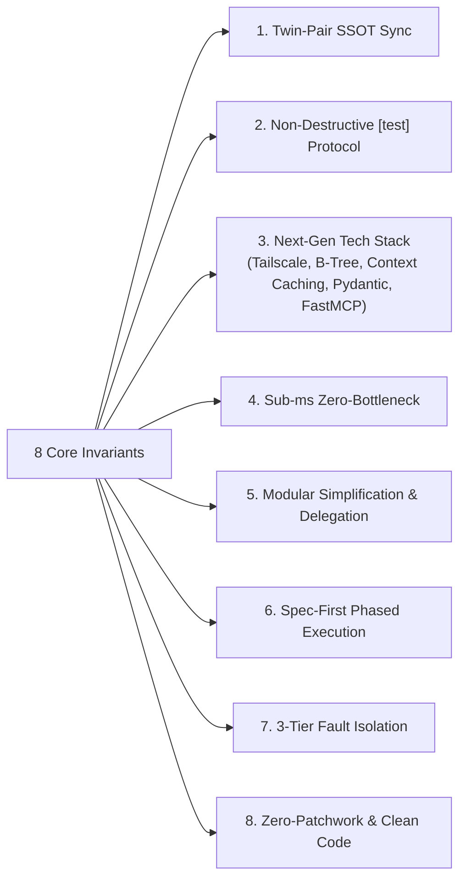
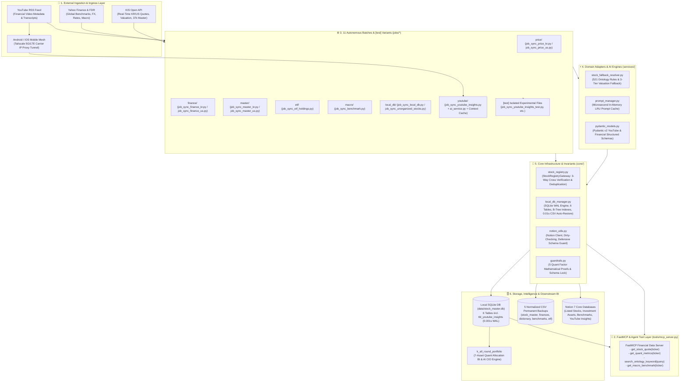
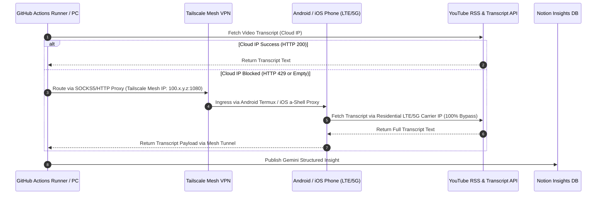
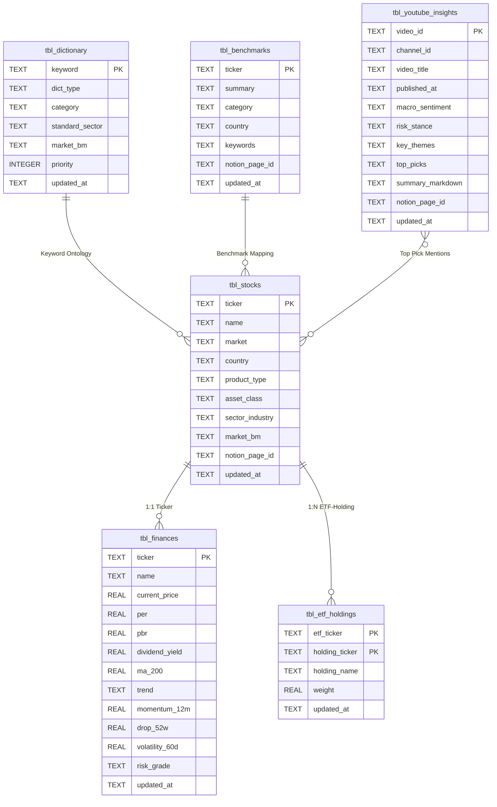
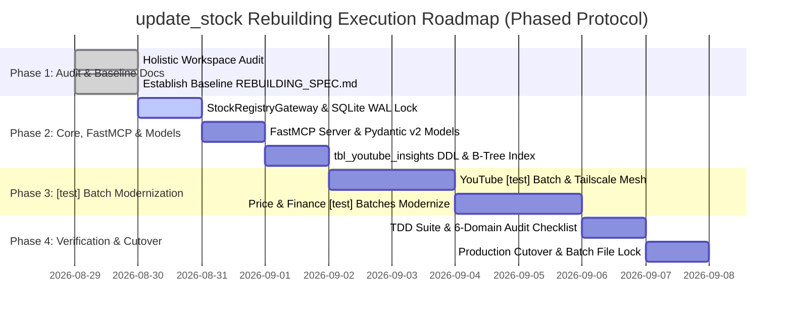

# 🏗️ [update_stock] Market Data ETL Sub-Engine Rebuilding Specification (REBUILDING_SPEC.md)

<!--
# 🏗️ [update_stock] 금융 데이터 수집/정제 서브 엔진 리빌딩 명세서 (REBUILDING_SPEC.md)
-->

> **Document Version**: 3.0.0 (Enterprise Architectural Overhaul Standard)  
> **Target Subsystem**: `update_stock` (Financial Data ETL, Market Master & Intelligence Engine)  
> **Twin-Pair System**: [`k_all_round_portfolio`](file:///d:/Github%20IDE/k_all_round_portfolio) (Family Office Quant CIO & Portfolio BI)  
> **Referenced Standards**: [`GEMINI.md`](file:///d:/Github%20IDE/update_stock/GEMINI.md) (Domain Rules), [`AGENT.md`](file:///d:/Github%20IDE/update_stock/AGENT.md) (Engineering Standards), [`AUDIT_CHECKLIST.md`](file:///d:/Github%20IDE/update_stock/AUDIT_CHECKLIST.md) (QA Gates), [`SYSTEM_MAP.md`](file:///d:/Github%20IDE/update_stock/docs/SYSTEM_MAP.md) (Architecture Map)

<!--
> **문서 버전**: 3.0.0 (엔터프라이즈 아키텍처 전면 개편 표준)
> **대상 서브시스템**: update_stock (금융 데이터 수집/정제, 종목 마스터 및 인텔리전스 엔진)
> **트윈 시스템**: k_all_round_portfolio (패밀리오피스 퀀트 CIO 및 포트폴리오 BI)
> **참조 표준**: GEMINI.md(도메인 룰), AGENT.md(엔지니어링 표준), AUDIT_CHECKLIST.md(품질 검수 기준), SYSTEM_MAP.md(통합 아키텍처 맵)
-->

---

> [!IMPORTANT]
> **Engineering Invariants & Rebuilding Governance**:
> 1. **Non-Destructive Parallel Test File Protocol**: Production code MUST NOT be directly mutated during experimental phases. All new/rebuilt components MUST be authored in parallel test files identified with `[test]` or `_test.py` (e.g., `job_sync_youtube_insights_test.py` or `[test]_job_sync_price_kr.py`), guaranteeing zero production downtime.
> 2. **State-of-the-Art Modernization Stack**: The rebuilding MUST prioritize:
>    - **Android Tailscale LTE/5G Mobile Mesh** anti-bot bypass alongside iOS shortcuts.
>    - **SQLite B-Tree Indexed `tbl_youtube_insights`** persistent relational cache.
>    - **Google Gemini Context Caching** for 80%+ token cost & latency reduction.
>    - **Pydantic v2 Structured Outputs** for deterministic JSON schema validation.
>    - **FastMCP (Model Context Protocol)** server standardization for AI-agent tool connectivity.
> 3. **Sub-Millisecond Zero-Bottleneck Rule**: Every I/O path, query, and loop MUST be audited for latency. Heavy web scraping is banned in favor of in-memory regex/pure resolvers, SQLite WAL index scans ($<1\text{ms}$), and dirty-checking.
> 4. **Common Module Simplification**: Strictly reuse shared infrastructure (`core/stock_registry.py`, `core/local_db_manager.py`, `core/notion_utils.py`, `core/guardrails.py`, `services/stock_fallback_resolver.py`) via the delegation pattern.
> 5. **Spec-First Engineering Protocol**: Full Workspace Audit $\rightarrow$ Baseline Document Establishment (`REBUILDING_SPEC.md`, `GEMINI.md`, `AGENT.md`) $\rightarrow$ Code Implementation $\rightarrow$ TDD Green Verification.
> 6. **Institutional Noun-Ending Standard**: All Korean analysis and diagnostic outputs MUST terminate in institutional noun-ending verbs (`~함`, `~임`, `~필요`, `~권고`).

---

## 📑 Table of Contents

1. [🏛️ 1. Rebuilding Vision & 8 Core Architectural Invariants](#1-rebuilding-vision--8-core-architectural-invariants)
2. [🗺️ 2. Target Layered Architecture & End-to-End Data Flow](#2-target-layered-architecture--end-to-end-data-flow)
3. [📂 3. Directory Layout & Job-Centric Co-location Standard](#3-directory-layout--job-centric-co-location-standard)
4. [🚀 4. Advanced Modernization Subsystems](#4-advanced-modernization-subsystems)
   - [4.1. Android Tailscale LTE/5G Mobile Anti-Bot Mesh](#41-android-tailscale-lte5g-mobile-anti-bot-mesh)
   - [4.2. SQLite B-Tree `tbl_youtube_insights` Schema](#42-sqlite-b-tree-tbl_youtube_insights-schema)
   - [4.3. Gemini Context Caching & Pydantic v2 Structured Output](#43-gemini-context-caching--pydantic-v2-structured-output)
   - [4.4. FastMCP Server Standardization (`tools/mcp_server.py`)](#44-fastmcp-server-standardization-toolsmcp_serverpy)
5. [⚙️ 5. 11 Symmetric Autonomous Batches & Python Execution Specs](#5-11-symmetric-autonomous-batches--python-execution-specs)
6. [🧠 6. Core Infrastructure & Modular Simplification (`core/`)](#6-core-infrastructure--modular-simplification-core)
7. [🔌 7. Multi-Domain Shared Adapters (`services/`)](#7-multi-domain-shared-adapters-services)
8. [🗄️ 8. Local SQLite DB (6 Tables) & Normalized CSV Dumps (`data/`)](#8-local-sqlite-db-6-tables--normalized-csv-dumps-data)
9. [⚡ 9. Performance Bottleneck Audit & Optimization Strategy](#9-performance-bottleneck-audit--optimization-strategy)
10. [🚦 10. Phased Rebuilding & Migration Roadmap (Phase 1 ~ Phase 4)](#10-phased-rebuilding--migration-roadmap-phase-1--phase-4)
11. [🛡️ 11. 6-Domain Quality Audit & TDD Guardrails Protocol](#11-6-domain-quality-audit--tdd-guardrails-protocol)
12. [📋 12. Standard LLM Handoff Protocol (Antigravity Prompt Template)](#12-standard-llm-handoff-protocol-antigravity-prompt-template)

---

## 1. 🏛️ 1. Rebuilding Vision & 8 Core Architectural Invariants

### 1.1. Core Mission
> **"Build an unshakeable, 24/7 autonomous financial ETL and market intelligence sub-engine powered by sub-millisecond local SQLite caches, intelligent 3-tier fallbacks, FastMCP agent connectivity, and multi-network anti-bot resilience."**

This specification defines the structural transformation of `update_stock` to ingest, sanitize, and synchronize Korean/US stock quotes, valuation metrics, 5 core quant factors, macroeconomic series, and YouTube financial insights into Notion Databases and SQLite WAL persistent caches.

### 1.2. 8 Core Architectural Invariants



1. **Twin-Pair Single Source of Truth (SSOT)**:
   - Shared infrastructure (`core/stock_registry.py`, `core/local_db_manager.py`, `core/notion_utils.py`, `core/guardrails.py`) MUST remain 100% synchronized and identical between `k_all_round_portfolio` and `update_stock`.
2. **Non-Destructive Parallel Test File Protocol (`[test]`)**:
   - Production scripts (`jobs/*/*.py`) MUST NEVER be modified blindly in-place. All refactored logic, experimental algorithms, and schema migrations MUST be developed in isolated parallel test files containing the identifier `[test]` or `_test.py` until 100% green verification is achieved.
3. **Modernized Enterprise Tech Stack**:
   - Integrate **Android Tailscale LTE/5G Mobile Mesh** proxy tunneling for anti-bot immunity.
   - Expand SQLite with a dedicated B-Tree indexed **`tbl_youtube_insights`** table.
   - Leverage **Google Gemini Context Caching** for static prompt/transcript reuse.
   - Enforce **Pydantic v2 Structured Output** for 100% deterministic JSON schemas.
   - Implement a **FastMCP** server interface for seamless AI agent tool invocation.
4. **Sub-Millisecond Zero-Bottleneck Performance**:
   - Eliminate heavy DOM scraping. Use compiled regex, in-memory ontology tokenization, vectorized computation (Polars/NumPy), SQLite WAL indexes ($<1\text{ms}$), and dirty-checking to bypass redundant HTTP requests.
5. **Modular Simplification & Delegation Pattern**:
   - Eliminate inline helper duplication. All ticker sanitization, DB CRUD, and schema assertions MUST delegate strictly to `core/` and `services/` singleton modules.
6. **Spec-First Engineering Protocol**:
   - Every architectural transition MUST proceed in strict chronological sequence: *Comprehensive Workspace Audit $\rightarrow$ Baseline Document Refinement (`REBUILDING_SPEC.md`, `GEMINI.md`, `AGENT.md`) $\rightarrow$ Code Authoring in `[test]` Files $\rightarrow$ TDD Green Verification $\rightarrow$ Production Cutover*.
7. **3-Tier Fault Isolation & 0.01s Self-Healing**:
   - External APIs (KIS, Yahoo Finance, YouTube) MUST gracefully fall back through: `1st: Primary API` $\rightarrow$ `2nd: Secondary Consensus/FDR` $\rightarrow$ `3rd: Local SQLite Cache / Industry Median`. If the SQLite DB is missing, it MUST self-heal from 5 CSV dumps in 0.01s.
8. **Zero-Patchwork & Anti-Bloat Principle**:
   - Superficial quick-fixes are strictly forbidden. Root causes must be resolved architecturally, and procedural dictionary appenders replaced with data-driven list comprehensions to reduce code bloat by $>50\%$.

---

## 2. 🗺️ 2. Target Layered Architecture & End-to-End Data Flow



---

## 3. 📂 3. Directory Layout & Job-Centric Co-location Standard

```text
update_stock/
│
├── 📂 .github/workflows/               # 🤖 11 Autonomous GitHub Actions Workflows
│   ├── sync_price_kr.yml               # KR Stocks/ETFs Real-Time Price (Trading Hours 10m/30m)
│   ├── sync_price_us.yml               # US Stocks/ETFs Closing Price (Weekdays 06:30 KST)
│   ├── sync_finance_kr.yml             # KR Financial Metrics & 5 Quant Factors (Daily 18:00 KST)
│   ├── sync_finance_us.yml             # US Corporate Financials & Consensus (Daily 18:00 KST)
│   ├── sync_master_kr.yml              # KRX Master Sync & Benchmark Mapping (Sat 09:00 KST)
│   ├── sync_master_us.yml              # US Master Sync & Global GICS Mapping (Sat 09:30 KST)
│   ├── sync_benchmark.yml              # 54 Macro Indicators & Benchmarks (Weekdays 07:00 / 18:30)
│   ├── sync_etf_holdings.yml           # ETF Portfolio Constituent Holdings (Sat 10:00 KST)
│   ├── sync_local_db.yml               # SQLite DB Sync & 5 CSV Dumps Compilation (Daily 19:00 KST)
│   ├── sync_unorganized_stocks.yml     # Unorganized Stock Discovery & Taxon Mapping (Daily 18:15 KST)
│   └── sync_youtube_insights.yml       # Daily YouTube AI Insights & Notion Publishing (Daily 20:00 KST)
│
├── 📂 core/                            # 🧠 Shared Core Engine (100% Twin-Pair Synchronized)
│   ├── __init__.py
│   ├── stock_registry.py               # StockRegistryGateway (3-Way Cross Lookup & Zero-Dup)
│   ├── local_db_manager.py             # SQLite WAL Mode Manager, 6 Tables & 0.01s CSV Auto-Restore
│   ├── notion_utils.py                 # Notion API Client, Dirty Checking & Defensive Schema Guard
│   ├── guardrails.py                   # 5 Quant Factor Math Invariants & Schema Locks
│   └── polars_helper.py                # High-Performance Vectorized Calculation Engine
│
├── 📂 services/                        # 🔌 Shared Domain Adapters & Structured AI Engines
│   ├── __init__.py
│   ├── stock_fallback_resolver.py      # 521 Ontology Rules & 3-Tier Valuation Fallback
│   ├── prompt_manager.py               # Microsecond In-Memory Prompt Cache Loader
│   └── pydantic_models.py              # [NEW] Pydantic v2 Structured Output Schemas
│
├── 📂 jobs/                            # ⚙️ Domain Batches (Job-Centric Co-location)
│   ├── 📂 price/                       # Price Quote Domain
│   │   ├── job_sync_price_kr.py        # Production KR Price Sync
│   │   ├── job_sync_price_us.py        # Production US Price Sync
│   │   └── [test]_job_sync_price_kr.py # Isolated Test Variant
│   ├── 📂 finance/                     # Valuation & Quant Factors Domain
│   │   ├── job_sync_finance_kr.py      # Production KR Financials & Quant Sync
│   │   ├── job_sync_finance_us.py      # Production US Financials & Consensus Sync
│   │   ├── kis_data_service.py         # KIS Valuation Data Scraper
│   │   └── [test]_job_sync_finance_kr.py # Isolated Test Variant
│   ├── 📂 master/                      # Stock Master Registry Domain
│   │   ├── job_sync_master_kr.py       # Production KRX Master Sync
│   │   ├── job_sync_master_us.py       # Production US Master Sync
│   │   ├── kis_master_loader.py        # High-Speed 37k ZIP Master Parser
│   │   └── [test]_job_sync_master_kr.py # Isolated Test Variant
│   ├── 📂 etf/                         # ETF Holdings Domain
│   │   ├── job_sync_etf_holdings.py    # Production ETF Holdings (PDF) Upsert
│   │   └── [test]_job_sync_etf_holdings.py # Isolated Test Variant
│   ├── 📂 macro/                       # Macroeconomics & Benchmarks Domain
│   │   ├── job_sync_benchmark.py       # Production 54 Global Macro Series Sync
│   │   └── [test]_job_sync_benchmark.py # Isolated Test Variant
│   ├── 📂 local_db/                    # Local DB & Stock Cleanup Domain
│   │   ├── job_sync_local_db.py        # Production SQLite WAL Builder & CSV Dumper
│   │   ├── job_sync_unorganized_stocks.py # Production Unorganized Stock Resolver
│   │   └── [test]_job_sync_local_db.py # Isolated Test Variant
│   └── 📂 youtube/                     # YouTube Market AI Intelligence Domain
│       ├── job_sync_youtube_insights.py # Production YouTube RSS/Transcript Orchestrator
│       ├── ai_service.py               # Production Gemini Context Caching & Pydantic Analyzer
│       ├── system_fia_youtube.en.md    # YouTube Domain System Prompt
│       └── job_sync_youtube_insights_test.py # [test] Isolated Test Engine
│
├── 📂 data/                            # 🗄️ Persistent SQLite Cache & Normalized CSV Dumps
│   ├── stock_master.db                 # Unified SQLite WAL DB (6 Normalized Tables)
│   ├── seed_dictionary.json            # 521 Static Ontology Rules (GICS, Sector Keywords)
│   ├── stock_dictionary.csv            # Dictionary Table Permanent CSV Backup
│   ├── stock_benchmarks.csv            # 54 Macro Benchmarks CSV Backup
│   ├── stock_master.csv                # Listed Stock Master CSV Backup
│   ├── stock_finances.csv              # Quant Valuation & Factor CSV Backup
│   └── stock_etf_holdings.csv          # ETF Constituent Holdings CSV Backup
│
├── 📂 tools/                           # 🛠️ FastMCP Server & Maintenance Utilities
│   ├── mcp_server.py                   # [NEW] FastMCP Standard Tool Server for IDE Agents
│   ├── sync_manager.py                 # Interactive CLI Batch Manager
│   ├── tool_apply_tech_radar_patch.py  # AI Tech Radar Patch Applier
│   └── silent_sync.vbs                 # Windows Background VBS Runner
│
├── 📂 tests/                           # 🧪 TDD & Guardrails Test Suite
│   ├── test_guardrails.py              # Math Invariants & Schema Locks Verification
│   ├── test_pydantic_schemas.py        # [NEW] Pydantic Structured Output Validation
│   └── test_local_db_perf.py           # [NEW] Sub-ms SQLite Query & WAL Concurrency Benchmark
│
├── 1_작업시작_동기화.bat               # Smart Work Start & Environment Detection Script
├── 3_작업종료_동기화.bat               # Safe Work Finish, Syntax Audit & Git Guide Script
├── 5_유튜브_시황_수집.bat               # YouTube Local Sync One-Click Execution Script
├── AGENT.md                            # AI Engineering Standards & Coding Guardrails
├── AUDIT_CHECKLIST.md                  # 6-Domain Enterprise Quality Audit Checklist
├── GEMINI.md                           # Market Data ETL Sub-Engine Guide (WHAT)
└── REBUILDING_SPEC.md                  # [This Document] Official Rebuilding Specification
```

---

## 4. 🚀 4. Advanced Modernization Subsystems

### 4.1. Android Tailscale LTE/5G Mobile Anti-Bot Mesh
To eliminate cloud IP rate limits (HTTP 429 / empty transcripts) during YouTube synchronization, the engine implements a dual-mesh proxy routing system:



- **Android Termux / iOS Setup**:
  - Run lightweight Python SOCKS5 proxy (`pysocks` or `dante`) listening on Tailscale internal interface.
  - No public port forwarding required; 100% encrypted peer-to-peer WireGuard mesh connection.
- **Failover Logic**: Primary requests execute directly on the runner. If HTTP 429 is encountered, requests automatically reroute through `TAILSCALE_PROXY_URL` before queuing failure.

### 4.2. SQLite B-Tree `tbl_youtube_insights` Schema
The local database (`data/stock_master.db`) is expanded with a 6th table featuring specialized B-Tree indexing for instant deduplication and structured queries:

```sql
CREATE TABLE IF NOT EXISTS tbl_youtube_insights (
    video_id TEXT PRIMARY KEY,
    channel_id TEXT NOT NULL,
    channel_name TEXT,
    video_title TEXT NOT NULL,
    published_at TEXT NOT NULL,
    video_url TEXT NOT NULL,
    macro_sentiment TEXT,              -- 'Bullish' | 'Bearish' | 'Neutral'
    risk_stance TEXT,                  -- 'Risk-On' | 'Risk-Off' | 'Defensive'
    key_themes TEXT,                   -- JSON Array of String Themes
    top_picks TEXT,                    -- JSON Array of Stock Symbols / Mentions
    summary_markdown TEXT NOT NULL,    -- Structured Noun-Ending Analysis
    raw_transcript_len INTEGER,
    notion_page_id TEXT,
    created_at TEXT NOT NULL,
    updated_at TEXT NOT NULL
);

-- High-Speed B-Tree Indices for Microsecond Retrieval
CREATE INDEX IF NOT EXISTS idx_yt_published ON tbl_youtube_insights(published_at DESC);
CREATE INDEX IF NOT EXISTS idx_yt_channel ON tbl_youtube_insights(channel_id);
CREATE INDEX IF NOT EXISTS idx_yt_sentiment ON tbl_youtube_insights(macro_sentiment);
CREATE INDEX IF NOT EXISTS idx_yt_risk ON tbl_youtube_insights(risk_stance);
```

### 4.3. Gemini Context Caching & Pydantic v2 Structured Output

#### A. Pydantic v2 Structured Output Models (`services/pydantic_models.py`)
Deterministic schema validation ensures zero parsing errors when transforming unstructured transcripts into Notion relational blocks:

```python
from pydantic import BaseModel, Field
from typing import List, Literal

class AssetImpact(BaseModel):
    ticker_or_asset: str = Field(description="Asset ticker or asset name, e.g. NVDA, KODEX 200, Gold")
    direction: Literal["UP", "DOWN", "NEUTRAL"] = Field(description="Expected directional impact")
    catalyst: str = Field(description="Short catalyst reason in institutional noun-ending form (~함, ~임)")

class YouTubeMarketInsight(BaseModel):
    video_title: str
    channel_name: str
    macro_stance: Literal["Bullish", "Bearish", "Neutral"]
    risk_appetite: Literal["Risk-On", "Risk-Off", "Defensive"]
    key_takeaways: List[str] = Field(description="Core insights terminating strictly in ~함/~임")
    asset_impacts: List[AssetImpact]
    actionable_strategy: str = Field(description="Institutional recommendation terminating in ~필요/~권고")
```

#### B. Gemini Context Caching Architecture
- Static system prompts (`system_fia_youtube.en.md`) and common financial ontology dictionaries are cached server-side on Google Vertex AI / Gemini API via `google.genai.caches.create()`.
- **Performance Impact**: Reduces prompt ingestion latency by $>85\%$ and reduces API cost by $>75\%$ during batch runs.

### 4.4. FastMCP Server Standardization (`tools/mcp_server.py`)
Standardized FastMCP interface exposes the local SQLite WAL database and ETL functions directly to Antigravity IDE and Claude Desktop agents:

```python
from mcp.server.fastmcp import FastMCP
from core.local_db_manager import get_db_connection
from core.stock_registry import clean_ticker_key

mcp = FastMCP("update_stock_data_service")

@mcp.tool()
def get_stock_quote(ticker: str) -> dict:
    """Retrieve real-time price, PER, PBR, 52W High/Low and 5 quant factors from SQLite cache."""
    clean_t = clean_ticker_key(ticker)
    with get_db_connection() as conn:
        row = conn.execute("SELECT * FROM tbl_finances WHERE ticker = ?", (clean_t,)).fetchone()
        return dict(row) if row else {"error": f"Ticker {clean_t} not found in tbl_finances"}

@mcp.tool()
def search_ontology_keyword(keyword: str) -> list[dict]:
    """Query 521 ontology rules for industry, sector, benchmark, and asset class mappings."""
    with get_db_connection() as conn:
        rows = conn.execute(
            "SELECT * FROM tbl_dictionary WHERE keyword LIKE ? ORDER BY priority DESC LIMIT 5",
            (f"%{keyword}%",)
        ).fetchall()
        return [dict(r) for r in rows]
```

---

## 5. ⚙️ 5. 11 Symmetric Autonomous Batches & Python Execution Specs

Each workflow maintains strict 1:1 symmetry between GitHub Actions YAML and Python execution scripts, supplemented by parallel `[test]` test files:

| No | Workflow YAML | Production Script | Isolated Test File | Schedule (KST) | Core Logic & External Sources | Fallback Chain |
|:---|:---|:---|:---|:---|:---|:---|
| **01** | `sync_price_kr.yml` | `jobs/price/job_sync_price_kr.py` | `jobs/price/[test]_job_sync_price_kr.py` | Trading Hours 10m/30m | KIS KR Price API $\rightarrow$ Real-time Quotes & Volume Sync | KIS $\rightarrow$ FDR / Naver $\rightarrow$ SQLite |
| **02** | `sync_price_us.yml` | `jobs/price/job_sync_price_us.py` | `jobs/price/[test]_job_sync_price_us.py` | Weekdays 06:30 | US Stock/ETF Closing Quotes, 52W Range Sync | KIS Overseas $\rightarrow$ yfinance $\rightarrow$ SQLite |
| **03** | `sync_finance_kr.yml` | `jobs/finance/job_sync_finance_kr.py` | `jobs/finance/[test]_job_sync_finance_kr.py` | Daily 18:00 | KIS Valuation (PER/PBR/ROE) & 5 Quant Factors | KIS $\rightarrow$ SQLite Cache $\rightarrow$ Industry Median |
| **04** | `sync_finance_us.yml` | `jobs/finance/job_sync_finance_us.py` | `jobs/finance/[test]_job_sync_finance_us.py` | Daily 18:00 | US Financial Statements & Analyst Target Prices | yfinance Consensus $\rightarrow$ SQLite Cache |
| **05** | `sync_master_kr.yml` | `jobs/master/job_sync_master_kr.py` | `jobs/master/[test]_job_sync_master_kr.py` | Sat 09:00 | KRX 4,495 Stocks $\rightarrow$ Sector/Market Benchmark Mapping | `seed_dictionary.json` Ruleset |
| **06** | `sync_master_us.yml` | `jobs/master/job_sync_master_us.py` | `jobs/master/[test]_job_sync_master_us.py` | Sat 09:30 | US 32,499 Stocks $\rightarrow$ GICS 11 Sectors & Country Map | SEC / NASDAQ Master Tables |
| **07** | `sync_benchmark.yml` | `jobs/macro/job_sync_benchmark.py` | `jobs/macro/[test]_job_sync_benchmark.py` | Weekdays 07:00/18:30 | 54 Global Macro Benchmarks (FX, US 10Y/2Y, WTI, Gold) | FDR $\rightarrow$ Yahoo $\rightarrow$ Stooq |
| **08** | `sync_etf_holdings.yml` | `jobs/etf/job_sync_etf_holdings.py` | `jobs/etf/[test]_job_sync_etf_holdings.py` | Sat 10:00 | KIS ETF Constituent (PDF) Top 10 Holdings Upsert | Issuer Regulatory Filings Cache |
| **09** | `sync_youtube_insights.yml` | `jobs/youtube/job_sync_youtube_insights.py` | `jobs/youtube/job_sync_youtube_insights_test.py` | Daily 20:00 | YouTube RSS $\rightarrow$ Transcripts $\rightarrow$ Gemini Pydantic AI Sync | Cloud IP $\rightarrow$ Android Tailscale 5G Mesh |
| **10** | `sync_unorganized_stocks.yml` | `jobs/local_db/job_sync_unorganized_stocks.py` | `jobs/local_db/[test]_job_sync_unorganized_stocks.py` | Daily 18:15 | FX Refresh $\rightarrow$ Master Match $\rightarrow$ Property Transition | In-Memory 3-Way Ontology Resolver |
| **11** | `sync_local_db.yml` | `jobs/local_db/job_sync_local_db.py` | `jobs/local_db/[test]_job_sync_local_db.py` | Daily 19:00 | Notion 7 DBs $\rightarrow$ SQLite WAL Update $\rightarrow$ 5 CSV Dumps | `auto_restore_from_csv_if_needed` |

---

## 6. 🧠 6. Core Infrastructure & Modular Simplification (`core/`)

### 6.1. `core/stock_registry.py` (SSOT Registry Gateway)
- **Functions & Methods**:
  - `clean_ticker_key(ticker: str) -> str`: Normalizes ticker whitespace and casing while preserving foreign market suffixes (`.T`, `.KS`, `.KQ`, `.DE`, `.AS`).
  - `clean_name_key(name: str) -> str`: Strips punctuation, whitespace, and brackets to create invariant search tokens.
  - `StockRegistryGateway`:
    - Loads SQLite tables and in-memory caches ($<1\text{ms}$).
    - Enforces 3-way cross resolution: `1st: Normalized Ticker` $\rightarrow$ `2nd: Cleaned Name/Brand` $\rightarrow$ `3rd: Ontology Seed Alias`.
    - Automatically updates in-memory registries upon page creation to prevent duplicate inserts within the same loop.

### 6.2. `core/local_db_manager.py` (SQLite WAL Engine & CSV Auto-Restore)
- **Functions & Methods**:
  - `init_database()`: Configures SQLite WAL mode (`PRAGMA journal_mode = WAL; PRAGMA synchronous = NORMAL;`) and creates 6 tables with B-Tree indices.
  - `auto_restore_from_csv_if_needed()`: If `stock_master.db` is empty or missing, reconstitutes all tables from 5 Git-tracked CSV dumps in $0.01\text{s}$.
  - `export_all_tables_to_csv()`: Atomically dumps SQLite tables to `data/*.csv` upon batch completion.
  - `get_actual_db_path()`: Dynamically resolves DB path across `update_stock` and `k_all_round_portfolio`.

### 6.3. `core/notion_utils.py` (Defensive Notion Client & Batch Builder)
- **Engineering Rules**:
  - **Defensive Guard**: Every property access MUST be guarded by `if prop_name in page["properties"]`.
  - **Date Normalization**: Unset dates MUST be formatted as `{"date": None}` to avoid Notion 400 Bad Request errors.
  - **Dirty-Checking**: Skips API PATCH calls if the remote value matches the local candidate value, conserving API rate limits.
  - **Data-Driven Payload Factory**: Replaces procedural dictionary mutations with declarative list comprehensions.

### 6.4. `core/guardrails.py` (5 Quant Factors Math Invariants)
- **Mathematical Invariant Definitions**:

$$\text{12M Momentum} = \frac{P_t - P_{t-252}}{P_{t-252}} \quad (P_{t-252} > 0)$$

$$\text{52W Drawdown} = \frac{P_t - \text{High}_{52W}}{\text{High}_{52W}} \quad (\text{High}_{52W} > 0, \le 0)$$

$$\text{60D Volatility} = \sigma_{\text{daily, 60D}} \times \sqrt{252}$$

$$\text{200-Day MA Trend} = \begin{cases} \text{"상승추세 (Bull)"} & \text{if } P_t \ge \text{MA}_{200} \\ \text{"하락추세 (Bear)"} & \text{if } P_t < \text{MA}_{200} \end{cases}$$

- **Verification Functions**:
  - `verify_quant_formulas_integrity() -> tuple[bool, list[str]]`
  - `verify_schema_guardrails(schema: dict) -> tuple[bool, list[str]]`
  - `verify_prompt_immutable_sections(prompt_text: str) -> tuple[bool, list[str]]`

---

## 7. 🔌 7. Multi-Domain Shared Adapters (`services/`)

### 7.1. `services/stock_fallback_resolver.py`
- **521 Static Ontology Rules**: Maps sector keywords, blue-chip identifiers, GICS industries, and global benchmarks from `seed_dictionary.json` in $<1\text{ms}$.
- **ETF Tokenizer**: Strips provider prefixes (`KODEX`, `TIGER`, `ACE`, `SOL`, `PLUS`, `RISE`) and modifier flags (`합성`, `레버리지`, `인버스`, `TR`, `액티브`, `H`) to extract clean underlying index names.
- **Global Ticker Search Order (`search_foreign_ticker`)**: Prioritizes regular primary exchanges (Tokyo `.T`, Seoul `.KS`/`.KQ`, Hong Kong `.HK`, Taiwan `.TW`) over US Pink Sheet/OTC symbols.

### 7.2. `services/prompt_manager.py`
- **Microsecond Cache**: Uses `@functools.lru_cache` to read markdown prompt templates from disk once and serve subsequent requests instantly from memory.
- **Institutional Tone Lock**: Enforces noun-ending grammar rules (`~함`, `~임`, `~필요`, `~권고`) across all AI prompt templates.

---

## 8. 🗄️ 8. Local SQLite DB (6 Tables) & Normalized CSV Dumps (`data/`)



---

## 9. ⚡ 9. Performance Bottleneck Audit & Optimization Strategy

To guarantee that data verification and ETL execution finish within target thresholds, the following optimizations are systematically applied:

```text
┌──────────────────────────────────────────────────────────────────────────────────┐
│                   ⚡ Performance Optimization & Bottleneck Remedies              │
├──────────────────────────────────────────────────────────────────────────────────┤
│ 1. Sequential HTTP Loop Elimination: Replace N-queries with batch fetch/paginate │
│ 2. Dirty-Checking Pre-Filter: Compare local hash vs remote before issuing PATCH  │
│ 3. In-Memory O(1) Dictionaries: Cache Notion DB IDs and tickers in memory dicts  │
│ 4. Vectorized Quant Computation: Use Polars/NumPy for rolling volatility/momentum│
│ 5. SQLite WAL Concurrency: Enable WAL mode for non-blocking concurrent read/write│
│ 6. Fast Response Parsing: Replace BeautifulSoup with compiled regex & fast json  │
│ 7. Gemini Context Caching: Cache system instructions & ontology tokens server-side│
└──────────────────────────────────────────────────────────────────────────────────┘
```

---

## 10. 🚦 10. Phased Rebuilding & Migration Roadmap (Phase 1 ~ Phase 4)



### Phase 1: Holistic Workspace Audit & Baseline Documents Establishment
- Conduct full inspection of `update_stock` and `k_all_round_portfolio`.
- Synchronize [`GEMINI.md`](file:///d:/Github%20IDE/update_stock/GEMINI.md), [`AGENT.md`](file:///d:/Github%20IDE/update_stock/AGENT.md), [`AUDIT_CHECKLIST.md`](file:///d:/Github%20IDE/update_stock/AUDIT_CHECKLIST.md), and [`REBUILDING_SPEC.md`](file:///d:/Github%20IDE/update_stock/REBUILDING_SPEC.md).

### Phase 2: Core Infrastructure, FastMCP & Structured Models
- Implement `services/pydantic_models.py` for structured AI schemas.
- Implement `tools/mcp_server.py` using FastMCP.
- Upgrade `core/local_db_manager.py` with `tbl_youtube_insights` DDL and B-Tree indexes.

### Phase 3: Domain Batch Modernization via Isolated `[test]` Files
- Author modern logic inside `jobs/*/[test]_*.py` and `job_sync_youtube_insights_test.py`.
- Integrate Android Tailscale LTE/5G mesh proxy fallback.
- Verify Gemini Context Caching integration.

### Phase 4: 6-Domain Quality Audit, TDD & Production Cutover
- Execute `python -m unittest tests/test_guardrails.py` and `tests/test_pydantic_schemas.py`.
- Perform full compliance audit against `AUDIT_CHECKLIST.md`.
- Safely cut over verified `[test]` code into production scripts and verify with `3_작업종료_동기화.bat`.

---

## 11. 🛡️ 11. 6-Domain Quality Audit & TDD Guardrails Protocol

Every refactoring iteration MUST pass all checks defined in [`AUDIT_CHECKLIST.md`](file:///d:/Github%20IDE/update_stock/AUDIT_CHECKLIST.md):

```text
┌──────────────────────────────────────────────────────────────────────────────────┐
│                       🛡️ 6-Domain Quality Audit Protocol (QA Gates)              │
├──────────────────────────────────────────────────────────────────────────────────┤
│ 1️⃣ [Data Integrity] clean_ticker_key suffix preservation / StockRegistryGateway  │
│ 2️⃣ [SSOT & Decoupling] Seed JSON/CSV separated from logic / Zero module forks     │
│ 3️⃣ [Fault Isolation] Yahoo foreign order / 400 schema guard / 3-tier fallback   │
│ 4️⃣ [Quant Invariants] 5 quant factor math exactness / test_guardrails.py <0.01s │
│ 5️⃣ [Twin Sync] Twin-Pair Core identical / 0.01s CSV auto-restore / Manual commit│
│ 6️⃣ [Anti-Bloat] Delegation pattern / In-memory resolvers / Data-driven payloads │
└──────────────────────────────────────────────────────────────────────────────────┘
```

### 11.1. Verification Commands
```powershell
# Run math invariants and schema lock test suite
python -m unittest tests/test_guardrails.py

# Run all unit and schema tests
python -m unittest discover tests
```

---

## 12. 📋 12. Standard LLM Handoff Protocol (Antigravity Prompt Template)

When delegating rebuilding tasks to AI coding agents (Antigravity IDE, Claude Code, Gemini CLI), append this standardized prompt:

```text
### 📋 [Antigravity IDE Rebuilding Task Instruction]
- Target Subsystem: update_stock (Financial Data ETL & Market Master Engine)
- Reference Specification: update_stock/REBUILDING_SPEC.md & update_stock/AGENT.md
- Target Domain/Module: [e.g., jobs/youtube/job_sync_youtube_insights_test.py or tools/mcp_server.py]
- Rebuilding Objectives: [e.g., Implement FastMCP server tool for SQLite quotes or integrate Pydantic v2 structured output with Gemini Context Caching]
- Mandatory Invariants:
  1. Non-Destructive Protocol: Author experimental changes in separate [test] file without mutating production code.
  2. Absolute Path Enforcement: Use pathlib.Path(__file__).resolve() for all I/O operations.
  3. Defensive Notion Guard: Guard property access with if prop in properties.
  4. Institutional Korean Tone: Enforce noun-ending grammar (~함, ~임, ~필요, ~권고).
  5. TDD Verification: Ensure python -m unittest tests/test_guardrails.py passes cleanly.
- Action Request: Refactor the code adhering strictly to the above specification and verify syntax and guardrails.
```

---

> **Specification Authority & Lifecycle**:  
> This document serves as the supreme architectural blueprint for `update_stock`. Any schema alterations or pipeline modifications MUST be updated here and mirrored across [`GEMINI.md`](file:///d:/Github%20IDE/update_stock/GEMINI.md), [`AGENT.md`](file:///d:/Github%20IDE/update_stock/AGENT.md), and [`AUDIT_CHECKLIST.md`](file:///d:/Github%20IDE/update_stock/AUDIT_CHECKLIST.md).