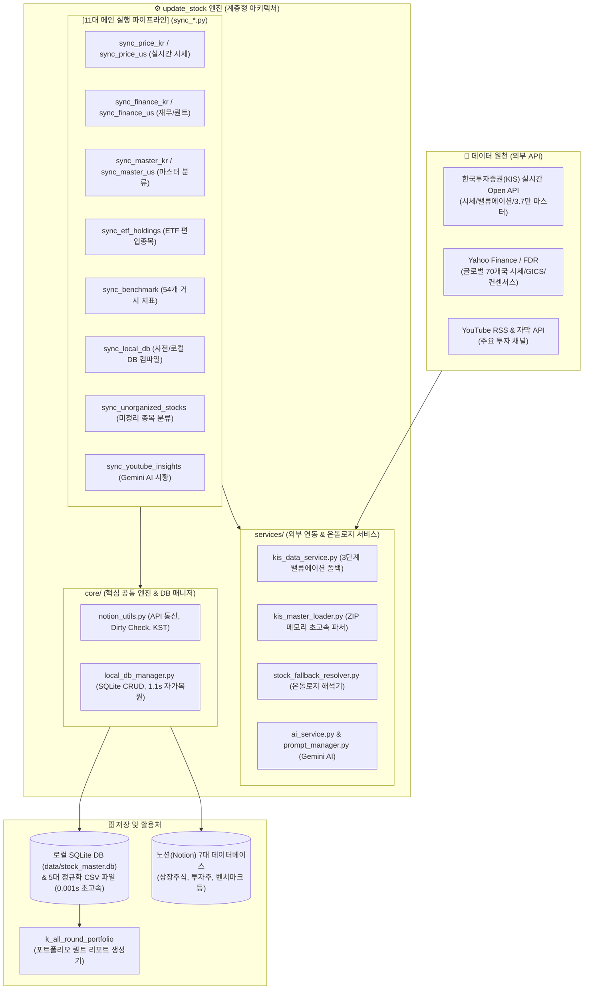

# 📦 update_stock: 금융 데이터 수집 & 정제 허브 (ETL Engine)

> **"금융 데이터 수집의 완전 자동화와 신뢰성 있는 단일 진실 공급원(SSOT) 구축"**  
> 한국/미국 주식 시세, 밸류에이션 재무제표, 5대 퀀트 팩터, ETF 구성종목(PDF), 거시 지표지수(54종), 유튜브 AI 시황을 자동 수집하여 **노션(Notion) 데이터베이스 및 로컬 SQLite DB(0.001s 캐시)와 100% 동기화**하는 자동화 엔진입니다.

---

## 🏛️ 1. 시스템 아키텍처 및 데이터 흐름도



---

## 📂 2. 폴더 및 파일 구조 완벽 가이드

프로젝트는 **[루트 파이프라인]**, **[core 핵심 라이브러리]**, **[services 외부 어댑터]**, **[data 영구 저장소]**로 완벽히 역할이 분리되어 있습니다.

```
update_stock/
│
├── 📂 .github/workflows/          # 🤖 GitHub Actions 자동화 워크플로우 (11개)
│   ├── sync_price_kr.yml          # 국내 주식/ETF 실시간 시세 (장중 10분/30분 주기)
│   ├── sync_price_us.yml          # 해외 주식/ETF 종가 및 52주 고저점
│   ├── sync_finance_kr.yml        # 국내 기업 밸류에이션 & 5대 퀀트팩터
│   ├── sync_finance_us.yml        # 해외 기업 재무제표 & 퀀트 지표
│   ├── sync_master_kr.yml         # 한국 거래소(KRX) 4,495개 마스터 & 벤치마크 매핑
│   ├── sync_master_us.yml         # 미국/글로벌 32,499개 마스터 & 벤치마크 매핑
│   ├── sync_etf_holdings.yml      # 국내 상장 222개 ETF 구성종목(PDF) 및 비중
│   ├── sync_benchmark.yml         # 54개 거시 경제 지표(금리/환율/원자재/지수)
│   ├── sync_local_db.yml          # 사전 DB 및 전체 SQLite/CSV 동기화 백업
│   ├── sync_unorganized_stocks.yml# 미정리 신규 종목 자동 발견 및 사전 등록
│   └── sync_youtube_insights.yml  # 매일 저녁 유튜브 AI 시황 요약 및 노션 적재
│
├── 📂 core/                       # 🧠 핵심 공통 엔진 (System Core)
│   ├── __init__.py
│   ├── notion_utils.py            # 노션 API 통신, Smart Dirty Checking, KST 시간 변환, 지수 백오프 재시도
│   └── local_db_manager.py        # SQLite DB(WAL 모드) CRUD, 5개 테이블 관리, 1.1s CSV 자가복원(Self-Healing)
│
├── 📂 services/                   # 🔌 외부 API 어댑터 & 도메인 서비스
│   ├── __init__.py
│   ├── kis_data_service.py        # 한투 밸류에이션 공식 API(FHKST01010100/HHDFS76200200) + yfinance 컨센서스
│   ├── kis_master_loader.py       # 한투 마스터 ZIP 압축파일 메모리 다운로드 및 전수 파싱 엔진
│   ├── stock_fallback_resolver.py # 온톨로지 사전 DB(521개) 해석기 & 초고속 정규식 ETF 토크나이저
│   ├── ai_service.py              # Google Gemini API 기반 Pydantic Structured Outputs 구조화 요약기
│   └── prompt_manager.py          # 영문 프롬프트(prompts/*.en.md) 마이크로초 단위 중앙 캐시 매니저
│
├── 📂 data/                       # 💾 영구 로컬 캐시 및 정규화 데이터 (Primary Key: ticker)
│   ├── stock_master.db            # 통합 SQLite 데이터베이스 (5개 정규화 테이블)
│   ├── stock_master.csv           # 420개 상장주식 마스터 메타데이터
│   ├── stock_finances.csv         # 361개 실시간 시세 및 퀀트 팩터
│   ├── stock_dictionary.csv       # 521개 테마/GICS 온톨로지 사전 규칙
│   ├── stock_benchmarks.csv       # 54개 시장/산업 벤치마크 지표 정의
│   └── stock_etf_holdings.csv     # 222개 ETF 편입종목 비중 데이터
│
├── 📂 prompts/                    # 📝 AI 시스템 프롬프트 템플릿
│   └── system_fia_youtube.en.md   # 유튜브 시황 분석용 FIA (Financial Intelligence Architect) 프롬프트
│
├── 1_작업시작_동기화.bat           # 🚀 출근/작업 시작 시 Git Pull 원클릭 동기화
├── 3_작업종료_동기화.bat           # 🏁 퇴근/작업 종료 시 Git Status 점검 및 Push 배치
├── sync_manager.py                # 배치 파일의 백엔드 다중 저장소 Git 동기화 매니저
├── requirements.txt               # 의존성 패키지 목록
└── .env / .env.example            # API 인증 토큰 및 노션 Database ID 설정
```

---

## ⚡ 3. 11대 메인 실행 파이프라인 상세

| 번호 | 실행 스크립트 | GitHub Actions | cron-job.org Event | 주요 수집 데이터 및 핵심 동작 |
|:---:|:---|:---|:---|:---|
| **1** | [`sync_price_kr.py`](file:///d:/Github%20IDE/update_stock/sync_price_kr.py) | `sync_price_kr.yml` | `kr_price_update` | 한투 API 기반 국내 주식/ETF 실시간 현재가, 전일대비, 거래량 갱신 ➔ DB 캐싱 |
| **2** | [`sync_price_us.py`](file:///d:/Github%20IDE/update_stock/sync_price_us.py) | `sync_price_us.yml` | `us_price_update` | Yahoo Finance 기반 해외 주식/ETF 종가, 52주 고저가, 등락률 갱신 ➔ DB 캐싱 |
| **3** | [`sync_finance_kr.py`](file:///d:/Github%20IDE/update_stock/sync_finance_kr.py) | `sync_finance_kr.yml` | `kr_finance_update` | KIS 공식 밸류에이션 + 5대 퀀트팩터(PER, PBR, ROE, 배당률, 200일선, 추세) 산출 |
| **4** | [`sync_finance_us.py`](file:///d:/Github%20IDE/update_stock/sync_finance_us.py) | `sync_finance_us.yml` | `us_finance_update` | 해외 기업 밸류에이션, 영업이익률, 목표주가, 투자의견, 퀀트 점수 산출 |
| **5** | [`sync_master_kr.py`](file:///d:/Github%20IDE/update_stock/sync_master_kr.py) | `sync_master_kr.yml` | `kr_master_sync` | KRX 4,495개 전수 마스터 대조 ➔ 종목명, 시장, 섹터, 우량주, 벤치마크 표준화 |
| **6** | [`sync_master_us.py`](file:///d:/Github%20IDE/update_stock/sync_master_us.py) | `sync_master_us.yml` | `us_master_sync` | 해외 32,499개 마스터 대조 ➔ 글로벌 GICS 매핑 및 3D 자산분류 자동 완성 |
| **7** | [`sync_benchmark.py`](file:///d:/Github%20IDE/update_stock/sync_benchmark.py) | `sync_benchmark.yml` | `benchmark_sync` | 54개 주요 거시 지표(환율, 금리, 유가, 금, 지수) 최신 수치 및 키워드 동기화 |
| **8** | [`sync_etf_holdings.py`](file:///d:/Github%20IDE/update_stock/sync_etf_holdings.py) | `sync_etf_holdings.yml` | `kr_etf_update` | 국내 상장 주요 ETF 222개 구성종목(PDF) 및 비중 추출 ➔ `tbl_etf_holdings` 적재 |
| **9** | [`sync_youtube_insights.py`](file:///d:/Github%20IDE/update_stock/sync_youtube_insights.py) | `sync_youtube_insights.yml` | `youtube_sync` | 유튜브 RSS $\rightarrow$ 자막 추출 $\rightarrow$ Gemini Pydantic AI 분석 $\rightarrow$ 노션 적재 |
| **10** | [`sync_unorganized_stocks.py`](file:///d:/Github%20IDE/update_stock/sync_unorganized_stocks.py) | `sync_unorganized_stocks.yml` | `daily_matcher` | 미정리 종목 환율 갱신 $\rightarrow$ 마스터 매칭 $\rightarrow$ '정리' 시 특이사항 이관 |
| **11** | [`sync_local_db.py`](file:///d:/Github%20IDE/update_stock/sync_local_db.py) | `sync_local_db.yml` | `local_db_sync` | 노션 전체 DB를 스캔하여 로컬 SQLite DB 및 CSV 5종을 완전 최신화 컴파일 |

---

## 💡 4. [맥락 복원 가이드] 몇 달 만에 돌아온 개발자를 위한 3분 맵

오랜만에 코드를 수정하거나 새로운 기능을 추가할 때 어디를 건드려야 할지 한눈에 파악할 수 있는 안내서입니다.

### ❓ Q1. "새로운 종목이나 ETF를 노션에 추가했는데 어떻게 처리되나요?"
- **답변**: 아무것도 수정할 필요가 없습니다! 노션에 티커만 넣고 `sync_master_kr.py` 또는 `sync_master_us.py`가 실행되면, **한투(KIS) 전수 마스터 + 온톨로지 사전 DB + yfinance**가 알아서 섹터, 벤치마크, 상품유형을 분석하여 노션에 채우고 SQLite DB에 신규 종목으로 `INSERT`합니다.

### ❓ Q2. "특정 종목의 섹터나 벤치마크 매핑 규칙을 바꾸고 싶다면?"
- **수정 위치**: 파이썬 코드를 수정할 필요 없이, **노션 [사전 DB (Dictionary DB)]**에 들어가서 키워드나 매핑 규칙 행을 추가/수정하면 됩니다.
- 노션 수정 후 `python sync_local_db.py`를 한 번 실행해 주면 즉시 SQLite DB(`tbl_dictionary`)에 0.001초 단위로 반영됩니다.

### ❓ Q3. "한투(KIS) API에서 시세/재무 가져오는 로직을 변경하고 싶다면?"
- **수정 위치**: [`services/kis_data_service.py`](file:///d:/Github%20IDE/update_stock/services/kis_data_service.py)
- KIS 실시간 API 호출 및 yfinance 컨센서스 수집 로직이 모두 이 파일 하나에 모듈화되어 있습니다.

### ❓ Q4. "로컬에서 특정 스크립트만 빠르게 디버깅/테스트하려면?"
- 터미널(PowerShell)에서 가상환경 파이썬으로 단독 실행:
  ```powershell
  .venv\Scripts\python.exe sync_master_kr.py
  .venv\Scripts\python.exe sync_finance_us.py --force
  ```

---

## 🛠️ 5. 시스템 유지보수 표준 운영 절차 (SOP Checklist)

안정적인 자동 수집 및 무장애 운영을 위한 정기 점검 리스트입니다:

### 🌞 1) 일간 점검 (Daily Checklist)
- [ ] **유튜브 AI 수집 확인 (`sync_youtube_insights.py`)**:
  - 매일 18:30 이후 `투자공부 by Youtube` DB에 신규 영상 요약 페이지가 정상 생성되었는지 확인.
- [ ] **미정리 종목 검토 및 이관 (`sync_unorganized_stocks.py`)**:
  - `미정리 종목` DB에서 내용을 검토한 후 **`정리` 체크박스(V)**를 눌러 `통합 특이사항 DB`로 이관 및 원본 삭제.

### 📅 2) 주간 점검 (Weekly Checklist)
- [ ] **GitHub Actions 실행 로그 확인**:
  - GitHub Actions 탭에서 11개 워크플로우가 실패 없이 녹색(Success)을 유지하는지 확인.
- [ ] **KIS API 토큰 캐시 유효성 점검**:
  - `.kis_token_cache.json` 24시간 재사용 캐시가 정상 작동하는지 확인.

### 🗓️ 3) 월간 점검 (Monthly Checklist)
- [ ] **상장폐지 및 신규 상장 종목 동기화 (`sync_master_kr.py`, `sync_master_us.py`)**:
  - 마스터 DB 전체 수동 실행(`workflow_dispatch` -> `IS_FULL_UPDATE=true`)으로 누락 종목 갱신.
- [ ] **지표지수 헬스체크 (`sync_benchmark.py`)**:
  - 54개 벤치마크 지표의 매칭률이 75% 이상 유지되는지 점검.

### 🏛️ 4) 분기 및 연간 점검 (Quarterly / Yearly Checklist)
- [ ] **한국투자증권 API Key 유효기간 갱신**:
  - KIS 실전 App Key/Secret은 1년 단위로 만료되므로 갱신 후 GitHub Secrets 및 `.env` 업데이트.
- [ ] **Gemini AI 모델 버전 점검**:
  - 신규 Gemini 모델 출시 시 `prompts/system_fia_youtube.en.md` 템플릿 점검 및 테스트.
