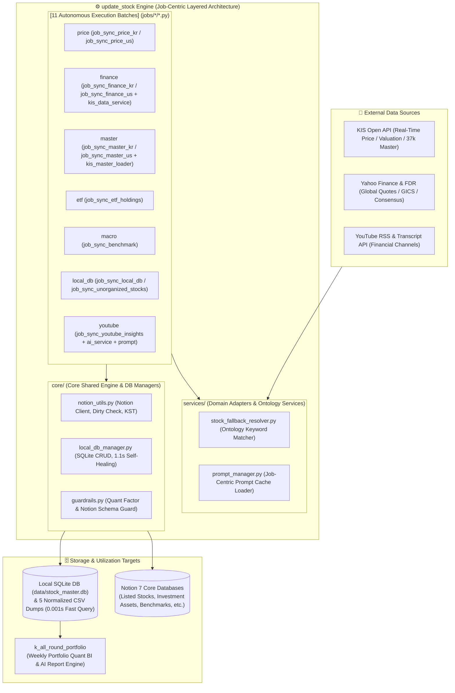

# 📦 update_stock: Financial Market Data ETL Hub (Data Engine)

<!--
# 📦 update_stock: 금융 데이터 수집 & 정제 허브 (ETL Engine)
-->

> **"Fully Automated Financial Data Acquisition and Reliable Single Source of Truth (SSOT)"**  
> Collects real-time Korean/US stock prices, valuation financials, 5 quant factors, ETF constituents (PDF), 54 macroeconomic indicators, and YouTube AI insights, synchronizing **100% with Notion Databases and 0.001s Local SQLite Caches**.

<!--
> **"금융 데이터 수집의 완전 자동화와 신뢰성 있는 단일 진실 공급원(SSOT) 구축"**  
> 한국/미국 주식 시세, 밸류에이션 재무제표, 5대 퀀트 팩터, ETF 구성종목(PDF), 거시 지표지수(54종), 유튜브 AI 시황을 자동 수집하여 노션(Notion) 데이터베이스 및 로컬 SQLite DB(0.001s 캐시)와 100% 동기화하는 자동화 엔진입니다.
-->

> 🗺️ **전체 시스템 아키텍처 맵 & 초보자 가이드**: [SYSTEM_MAP.md](file:///d:/Github%20IDE/update_stock/docs/SYSTEM_MAP.md)를 참조하십시오.

---

## 🏛️ 1. System Architecture & Data Flow



---

## 📂 2. Directory Structure Guide (Job-Centric Co-location)

```text
update_stock/
│
├── 📂 .github/workflows/          # 🤖 GitHub Actions Automated Workflows (11 Workflows)
│   ├── sync_price_kr.yml          # Korean Stocks/ETFs Real-Time Prices (10m/30m intervals)
│   ├── sync_price_us.yml          # US Stocks/ETFs Closing Prices & 52-Week High/Low
│   ├── sync_finance_kr.yml        # Korean Valuation & 5 Core Quant Factors
│   ├── sync_finance_us.yml        # US Corporate Financials & Quant Indicators
│   ├── sync_master_kr.yml         # KRX Listed Stock Master & Benchmark Matching
│   ├── sync_master_us.yml         # US Listed Stock Master & Global GICS Mapping
│   ├── sync_etf_holdings.yml      # ETF Constituent Holdings (PDF) & Weights
│   ├── sync_benchmark.yml         # 54 Macroeconomic Indicators (Rates, FX, Oil, Gold)
│   ├── sync_local_db.yml          # Local SQLite DB & 5 CSV Dumps Sync & Backup
│   ├── sync_unorganized_stocks.yml# Discovery and Registration of Unorganized Stocks
│   └── sync_youtube_insights.yml  # Daily Evening YouTube AI Financial Insights
│
├── 📂 core/                       # 🧠 Core System Infrastructure
│   ├── __init__.py
│   ├── notion_utils.py            # Notion API Client, Dirty Checking, KST Converter
│   ├── local_db_manager.py        # SQLite WAL Mode CRUD, 5-Table Manager, CSV Self-Healing
│   └── guardrails.py              # 5 Quant Factor Mathematical Invariants & Schema Guardrails
│
├── 📂 services/                   # 🔌 Shared Multi-Domain Services
│   ├── __init__.py
│   ├── stock_fallback_resolver.py # 521 Ontology Dictionary Rules & ETF Tokenizer
│   └── prompt_manager.py          # Microsecond In-Memory Prompt Cache Loader
│
├── 📂 jobs/                       # ⚙️ Autonomous Execution Batches (Job-Centric Co-location)
│   ├── 📂 price/                  # job_sync_price_kr.py, job_sync_price_us.py
│   ├── 📂 finance/                # job_sync_finance_kr.py, job_sync_finance_us.py, kis_data_service.py
│   ├── 📂 master/                 # job_sync_master_kr.py, job_sync_master_us.py, kis_master_loader.py
│   ├── 📂 etf/                    # job_sync_etf_holdings.py
│   ├── 📂 macro/                  # job_sync_benchmark.py
│   ├── 📂 local_db/               # job_sync_local_db.py, job_sync_unorganized_stocks.py
│   └── 📂 youtube/                # job_sync_youtube_insights.py, ai_service.py, system_fia_youtube.en.md
│
├── 📂 data/                       # 💾 Local Permanent Cache & Normalized Data (Primary Key: ticker)
│   ├── stock_master.db            # Unified SQLite Database (5 Tables)
│   ├── stock_master.csv           # 420 Listed Stock Metadata
│   ├── stock_finances.csv         # 361 Real-Time Valuation & Quant Factors
│   ├── stock_dictionary.csv       # 521 Theme & GICS Ontology Rules
│   ├── stock_benchmarks.csv       # 54 Market/Sector Benchmark Definitions
│   └── stock_etf_holdings.csv     # 222 ETF Constituent Weight Datasets
│
├── 📂 tools/                      # 🛠️ Productivity & Synchronization Tools
│   ├── sync_manager.py            # Twin-Repository Bidirectional Git Sync Manager
│   └── tool_apply_tech_radar_patch.py # AI Tech Radar One-Click Patch Applier
│
├── 📂 tests/                      # 🧪 Unit Tests & Guardrail Verification
│   └── test_guardrails.py         # 5 Quant Factor & Notion Schema Verification
│
├── 1_작업시작_동기화.bat           # 🚀 Smart Work Start (Git Pull & Strategic Checklist)
├── 3_작업종료_동기화.bat           # 🏁 Smart Work Finish (Git Commit & Push)
├── AGENT.md                       # 🛡️ Engineering Standards & Clean Code Rules
├── GEMINI.md                      # 📊 Domain Master Specifications
├── requirements.txt               # Dependencies
└── .env / .env.example            # Environment Configuration
```

---

## ⚡ 3. 11 Autonomous Execution Pipelines

| # | Execution Script | GitHub Actions | cron-job.org Event | Data Collected & Core Action |
|:---:|:---|:---|:---|:---|
| **1** | [`jobs/price/job_sync_price_kr.py`](file:///d:/Github%20IDE/update_stock/jobs/price/job_sync_price_kr.py) | `sync_price_kr.yml` | `kr_price_update` | KIS Open API Korean stock/ETF real-time current price, change, volume |
| **2** | [`jobs/price/job_sync_price_us.py`](file:///d:/Github%20IDE/update_stock/jobs/price/job_sync_price_us.py) | `sync_price_us.yml` | `us_price_update` | Yahoo Finance US stock/ETF closing price, 52W high/low, rate of change |
| **3** | [`jobs/finance/job_sync_finance_kr.py`](file:///d:/Github%20IDE/update_stock/jobs/finance/job_sync_finance_kr.py) | `sync_finance_kr.yml` | `kr_finance_update` | KIS Valuation + 5 Quant Factors (PER, PBR, ROE, Dividend Yield, 200MA, Trend) |
| **4** | [`jobs/finance/job_sync_finance_us.py`](file:///d:/Github%20IDE/update_stock/jobs/finance/job_sync_finance_us.py) | `sync_finance_us.yml` | `us_finance_update` | US Corporate Valuation, Operating Margin, Target Price, Analyst Consensus |
| **5** | [`jobs/master/job_sync_master_kr.py`](file:///d:/Github%20IDE/update_stock/jobs/master/job_sync_master_kr.py) | `sync_master_kr.yml` | `kr_master_sync` | KRX 4,495 Full Master Comparison $\rightarrow$ Name, Sector, Benchmark Standardized |
| **6** | [`jobs/master/job_sync_master_us.py`](file:///d:/Github%20IDE/update_stock/jobs/master/job_sync_master_us.py) | `sync_master_us.yml` | `us_master_sync` | US 32,499 Master Comparison $\rightarrow$ Global GICS Mapping & Asset Categorization |
| **7** | [`jobs/macro/job_sync_benchmark.py`](file:///d:/Github%20IDE/update_stock/jobs/macro/job_sync_benchmark.py) | `sync_benchmark.yml` | `benchmark_sync` | 54 Global Macro Indicators (FX, Rates, Oil, Gold, Indices) Synchronization |
| **8** | [`jobs/etf/job_sync_etf_holdings.py`](file:///d:/Github%20IDE/update_stock/jobs/etf/job_sync_etf_holdings.py) | `sync_etf_holdings.yml` | `kr_etf_update` | Korean Top 222 ETF Constituents (PDF) & Weight Extraction $\rightarrow$ `tbl_etf_holdings` |
| **9** | [`jobs/youtube/job_sync_youtube_insights.py`](file:///d:/Github%20IDE/update_stock/jobs/youtube/job_sync_youtube_insights.py) | `sync_youtube_insights.yml` | `youtube_sync` | YouTube RSS $\rightarrow$ Multi-Language Subtitles $\rightarrow$ Gemini Pydantic AI Analysis |
| **10** | [`jobs/local_db/job_sync_unorganized_stocks.py`](file:///d:/Github%20IDE/update_stock/jobs/local_db/job_sync_unorganized_stocks.py) | `sync_unorganized_stocks.yml` | `daily_matcher` | Unorganized Stocks FX update $\rightarrow$ Master Matching $\rightarrow$ Transfer |
| **11** | [`jobs/local_db/job_sync_local_db.py`](file:///d:/Github%20IDE/update_stock/jobs/local_db/job_sync_local_db.py) | `sync_local_db.yml` | `local_db_sync` | Scan Full Notion DBs $\rightarrow$ Recompile Unified SQLite DB & 5 CSV Dumps |

<!--
## ⚡ 3. 11대 메인 실행 파이프라인 상세
1. jobs/price/job_sync_price_kr.py: 국내 주식/ETF 실시간 시세
2. jobs/price/job_sync_price_us.py: 미국 주식/ETF 종가 시세
3. jobs/finance/job_sync_finance_kr.py: 국내 재무비율 & 5대 퀀트팩터
4. jobs/finance/job_sync_finance_us.py: 미국 재무비율 & 5대 퀀트팩터
5. jobs/master/job_sync_master_kr.py: 국내 상장주식 마스터 DB 동기화
6. jobs/master/job_sync_master_us.py: 미국 상장주식 마스터 DB 동기화
7. jobs/macro/job_sync_benchmark.py: 글로벌 벤치마크/환율/금리 동기화
8. jobs/etf/job_sync_etf_holdings.py: ETF 구성종목(PDF) 증분 Upsert 동기화
9. jobs/youtube/job_sync_youtube_insights.py: 유튜브 RSS 자막 AI 구조화 분석
10. jobs/local_db/job_sync_unorganized_stocks.py: 미정리 종목 환율 갱신 -> 마스터 매칭 -> 특이사항 이관
11. jobs/local_db/job_sync_local_db.py: 통합 로컬 SQLite DB 및 CSV 5종 덤프 갱신
-->

---

## 💡 4. Context Restoration Guide (FAQ)

### ❓ Q1. How are newly added Notion stocks/ETFs processed?
- No code change is required. Enter the ticker into Notion, and when `job_sync_master_kr.py` or `job_sync_master_us.py` runs, **KIS Master + Ontology Dictionary DB + yfinance** automatically populate sector, benchmark, asset class and `INSERT` into SQLite DB.

### ❓ Q2. How to update sector/benchmark mapping rules for a stock?
- Simply add or modify keyword rows in **Notion [Dictionary DB (tbl_dictionary)]**.
- Run `python -m jobs.local_db.job_sync_local_db` to immediately compile changes into `tbl_dictionary` within SQLite.

### ❓ Q3. Where to modify KIS Open API price/valuation logic?
- Modify [`jobs/finance/kis_data_service.py`](file:///d:/Github%20IDE/update_stock/jobs/finance/kis_data_service.py).

### ❓ Q4. How to debug a specific job script locally?
- Run via terminal with virtual environment Python:
  ```powershell
  python -m jobs.master.job_sync_master_kr
  python -m jobs.finance.job_sync_finance_us --force
  ```

### ❓ Q5. How to run YouTube sync on iOS / Mobile without anti-bot IP blocks?
- Install `a-Shell` (Free ARM64 native terminal) or `iSH Shell` / `Pythonista` from App Store.
- Clone repository & install dependencies:
  ```bash
  git clone https://github.com/<user>/update_stock.git
  pip install requests python-dotenv notion-client yt-dlp youtube-transcript-api google-genai
  ```
- Set up iOS **[Shortcuts App ➔ Automation]**:
  - Trigger: Scheduled time (e.g. 08:00 AM, 06:00 PM) or "When Connected to Charger"
  - Action: Execute command in `a-Shell`:
    ```bash
    cd update_stock && git pull && python -m jobs.youtube.job_sync_youtube_insights
    ```
- Mobile carrier IP (LTE/5G) completely avoids cloud datacenter IP blocks (429), extracting 20,000+ characters of subtitles and updating Notion 100% reliably.

<!--
## 💡 4. [맥락 복원 가이드] FAQ
- Q1. 신규 종목 추가: 노션에 티커 등록 시 KIS 마스터 + 온톨로지 사전 DB가 자동 분류
- Q2. 매핑 규칙 수정: 노션 사전 DB (tbl_dictionary) 수정 후 python -m jobs.local_db.job_sync_local_db 실행
- Q3. 한투 API 로직 수정: jobs/finance/kis_data_service.py
- Q4. 로컬 디버깅 실행: python -m jobs.master.job_sync_master_kr
- Q5. iOS/모바일 안티봇 무인 자동화: a-Shell/iSH/Pythonista + iOS 단축어 자동화(특정 시간/충전기 연결 시 무인 실행)로 통신사 LTE/5G IP를 활용해 429 차단 0%로 노션 자동 적재
-->

