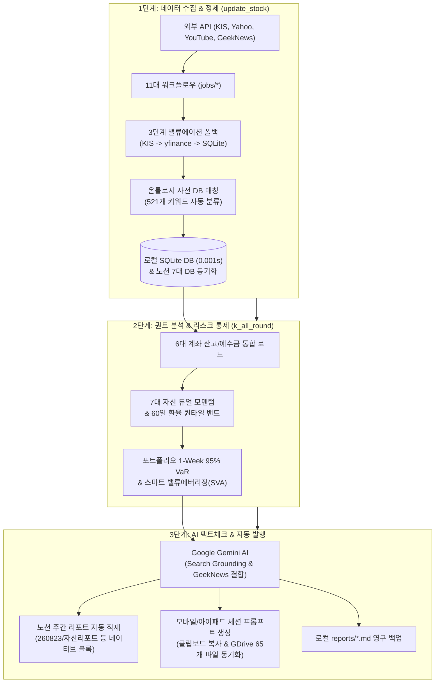

# 🗺️ [K-All-Round Master] Total System Architecture Map & Operation Guide

<!--
# 🗺️ [K-올라운드 마스터] 전체 프로젝트 시스템 통합 마스터 맵 & 운영 가이드 (SYSTEM_MAP.md)
-->

> **"A beginner-friendly yet technically rigorous master guide to the 24/7 autonomous financial data ETL hub and AI quant portfolio CIO system."**  
> This specification synthesizes [`GEMINI.md`](file:///d:/Github%20IDE/GEMINI.md) (Domain Rules), [`AGENT.md`](file:///d:/Github%20IDE/AGENT.md) (Engineering Standards), [`DOCUMENTATION.md`](file:///d:/Github%20IDE/k_all_round_portfolio/docs/DOCUMENTATION.md) (Operations), and the self-evolving AI Tech Radar pipeline into a single source of truth.

<!--
> **"초보자도 5분 만에 이해하고 실전 유지보수에 즉시 활용하는 24시간 자율 금융 데이터 수집 & AI 퀀트 CIO 시스템"**  
> 본 문서는 도메인 명세서(GEMINI.md), 엔지니어링 표준(AGENT.md), 운영 가이드(DOCUMENTATION.md), 그리고 AI 테크 레이더 자율 진화 체계를 집대성한 최상위 시스템 통합 마스터 맵입니다.
-->

---

## 🧭 [1부] 한눈에 보는 1분 요약 & Twin-Pair 랜드스케이프

### 💡 한 줄 비유
> **"24시간 자율 금융 데이터 수집/정제 공장(`update_stock`) + 패밀리오피스 수석 퀀트 CIO(`k_all_round_portfolio`)"**

본 워크스페이스는 사람이 매일 시세와 재무제표를 수동으로 검색하지 않아도, **클라우드(GitHub Actions)와 Gemini AI가 알아서 금융 시장 데이터를 수집·정제**하고, **노션(Notion)에 6대 투자 계좌를 통합 진단한 전문 퀀트 리포트를 자동 발행**하는 시스템입니다.

```text
┌─────────────────────────────────────────────────────────────────────────────────────────────────┐
│                                    📡 글로벌 금융 데이터 원천                                    │
│   • 한국투자증권(KIS) Open API (국내 4.4천 / 해외 3.2만 종목 실시간 시세, PER/PBR, 52주 고저점)    │
│   • Yahoo Finance & FinanceDataReader (글로벌 70개국 지수, 54개 거시경제 지표, 환율, 국채금리)  │
│   • YouTube RSS & 자막 API (주요 경제/투자 유튜브 채널 데일리 시황)                              │
│   • GeekNews (https://news.hada.io) Atom 피드 (국내 개발자 생태계 핫 토픽 & 신기술 오픈소스)      │
└────────────────────────────────────────────────┬────────────────────────────────────────────────┘
                                                 │ 11대 자동화 파이프라인 (GitHub Actions)
                                                 ▼
┌─────────────────────────────────────────────────────────────────────────────────────────────────┐
│ 📂 update_stock (서브 Public: 금융 데이터 ETL 허브)                                               │
│   • 11대 도메인 잡: price(시세), finance(재무), master(마스터), etf(편입종목), macro(지표), local_db  │
│   • 3단계 밸류에이션 폴백: KIS 공식 API ➔ yfinance 컨센서스 ➔ 로컬 SQLite 캐시                      │
│   • 521개 온톨로지 사전 DB & 초고속 ETF 토크나이저: 섹터/벤치마크/자산군 자동 분류              │
│   • 로컬 영구 캐시: stock_master.db (5개 정규화 테이블, WAL 모드) + 5종 CSV 백업                │
└────────────────────────────────────────────────┬────────────────────────────────────────────────┘
                                                 │ 0.001초 초고속 SQLite 퀀트 캐시 공급
                                                 ▼
┌─────────────────────────────────────────────────────────────────────────────────────────────────┐
│ 📂 k_all_round_portfolio (메인 Private: 7대 자산배분 BI & AI 리포트)                             │
│   • 6대 계좌(연금저축 2개, IRP, 연금이전, ISA, 일반직투) 실시간 자산/예수금 통합 집계            │
│   • 5대 퀀트 팩터 & 1-Week 95% VaR (Value at Risk) 산출 & 환율 60영업일 롤링 퀀타일 밴드 스위칭  │
│   • 스마트 밸류 에버리징(SVA): 목표 비중(±3.0%p) 및 추세/낙폭 가중 100만원 추천 매수 배분표    │
│   • Google Gemini AI (Search Grounding & GeekNews 팩트체크) ➔ 노션 네이티브 블록 리포트 자동 발행│
│   • 모바일/아이패드 세션 프롬프트 생성 ➔ 스마트폰 Gemini 앱 1:1 전속 CIO 상담 & GDrive 동기화     │
└────────────────────────────────────────────────┬────────────────────────────────────────────────┘
                                                 │ 최종 산출물 전달
                                                 ▼
┌─────────────────────────────────────────────────────────────────────────────────────────────────┐
│ 🗄️ 최종 활용처: 노션 포트폴리오 리포트 DB / 모바일 스마트폰 Gemini 앱 / reports/*.md 영구 백업  │
└─────────────────────────────────────────────────────────────────────────────────────────────────┘
```

---

## ⚙️ [2부] 시스템 엔드투엔드(End-to-End) 동작 원리



---

## ⏱️ [3부] 정기 실행 스케줄 및 트리거 매트릭스 (Schedules & Cron)

모든 작업은 GitHub Actions와 cron-job.org Webhook을 통해 정밀하게 스케줄링됩니다:

| 작업 영역 | 워크플로우 파일 | 실행 주기 (KST 기준) | 트리거 이벤트 | 주요 수집 및 처리 내용 |
|:---|:---|:---|:---|:---|
| **국내 시세** | `sync_price_kr.yml` | 평일 장중 (10분/30분 주기) | `kr_price_update` | 국내 주식/ETF 실시간 현재가, 등락률, 거래량 수집 |
| **해외 시세** | `sync_price_us.yml` | 평일 06:30 (미국장 마감 직후) | `us_price_update` | 미국 주식/ETF 종가, 52주 고저점, 등락률 수집 |
| **국내 재무** | `sync_finance_kr.yml` | 매일 18:00 | `kr_finance_update` | KIS 공식 밸류에이션(PER/PBR/ROE/배당률) & 5대 퀀트팩터 |
| **해외 재무** | `sync_finance_us.yml` | 매일 18:00 | `us_finance_update` | 해외 기업 재무제표, 영업이익률, 애널리스트 목표주가/투자의견 |
| **국내 마스터** | `sync_master_kr.yml` | 매주 토요일 09:00 | `kr_master_sync` | KRX 4,495개 전수 마스터 대조 ➔ 종목명/섹터/벤치마크 표준화 |
| **해외 마스터** | `sync_master_us.yml` | 매주 토요일 09:30 | `us_master_sync` | 미국 32,499개 마스터 대조 ➔ 글로벌 GICS 매핑 및 3D 분류 |
| **거시 지표** | `sync_benchmark.yml` | 매일 07:00 | `benchmark_sync` | 54개 거시 지표(환율, 미국채 10Y/2Y, 유가, 금, 지수) 동기화 |
| **ETF 편입종목** | `sync_etf_holdings.yml` | 매주 일요일 10:00 | `kr_etf_update` | 국내 상장 222개 주요 ETF 구성종목(PDF) 및 비중 추출 |
| **유튜브 AI 시황**| `sync_youtube_insights.yml`| 매일 18:30 | `youtube_sync` | 유튜브 RSS ➔ 다중자막 폴백 ➔ Gemini Pydantic AI 구조화 분석 |
| **미정리 종목** | `sync_unorganized_stocks.yml`| 매일 08:30 | `daily_matcher` | 신규 미정리 종목 환율 갱신 ➔ 마스터 자동 매칭 ➔ 특이사항 이관 |
| **로컬 DB 덤프**| `sync_local_db.yml` | 매일 19:00 | `local_db_sync` | 노션 전체 스캔 ➔ 로컬 SQLite DB (`stock_master.db`) 및 CSV 5종 최신화 |
| **AI 테크 레이더**| `sync_tech_radar.yml` | 매주 월요일 09:00 | `tech_radar` | KIS 깃허브 + GeekNews + PyPI 자동 탐색 & 리포트 저장 |
| **주간 포트폴리오**| `generate_portfolio_report.yml`| 매주 일요일 21:00 (또는 수동) | `generate_report` | 6대 계좌 퀀트 진단 + Gemini AI 리포트 노션 자동 발행 |

---

## 🛠️ [4부] 실전 유지보수 네비게이션 & 상황별 3분 수정 맵

| 내가 하고 싶은 작업 | 수정해야 할 파일 위치 | 테스트 및 검증 명령어 |
|:---|:---|:---|
| **자산군 목표 비중(%)이나 리밸런싱 규칙 변경** | [`k_all_round_portfolio/core/config_portfolio.py`](file:///d:/Github%20IDE/k_all_round_portfolio/core/config_portfolio.py) | `python -m tests.test_guardrails` |
| **6대 계좌별 운용 전략이나 세액공제 한도 수정** | [`k_all_round_portfolio/core/config_portfolio.py`](file:///d:/Github%20IDE/k_all_round_portfolio/core/config_portfolio.py) | 리포트 생성기 실행 |
| **포트폴리오 리포트 AI 프롬프트/문체 수정** | [`k_all_round_portfolio/jobs/quant_report/system_portfolio_quant.en.md`](file:///d:/Github%20IDE/k_all_round_portfolio/jobs/quant_report/system_portfolio_quant.en.md) | `python -m tests.test_prompts` |
| **유튜브 AI 요약 프롬프트 수정** | [`update_stock/jobs/youtube/system_fia_youtube.en.md`](file:///d:/Github%20IDE/update_stock/jobs/youtube/system_fia_youtube.en.md) | `python -m tests.test_prompts` |
| **모바일 Gemini 1:1 세션 프롬프트 템플릿 수정**| [`k_all_round_portfolio/tools/gemini_mobile_session.en.md`](file:///d:/Github%20IDE/k_all_round_portfolio/tools/gemini_mobile_session.en.md) | `python -m tools.tool_generate_gemini_prompt` |
| **신규 종목 테마/섹터 매핑 규칙 추가** | 노션 **사전 DB (`tbl_dictionary`)** 웹에서 행 추가 | `python -m jobs.local_db.job_sync_local_db` |
| **한투(KIS) 시세/재무 API 로직 수정** | [`update_stock/jobs/finance/kis_data_service.py`](file:///d:/Github%20IDE/update_stock/jobs/finance/kis_data_service.py) | `python -m jobs.finance.job_sync_finance_kr` |
| **포트폴리오 리포트 로컬 즉시 발행** | 터미널 또는 배치 파일 | `python -m jobs.quant_report.job_generate_portfolio_report` |
| **스마트 작업종료 & 모바일 GDrive 동기화** | **`3_작업종료_동기화.bat`** 더블클릭 | 당일 수정본 문법검증 + Git Push + 모바일 GDrive 동기화 + 클립보드 복사 |
| **AI 테크레이더 제안 패치 원클릭 적용** | **`4_테크레이더_패치적용.bat`** 더블클릭 | 의존성 승격 + 헬퍼 주입 + 가드레일 검증 |

---

## 🤝 [5부] 4대 LLM 인텔리전스 & 사용자와의 상호작용 (Human-in-the-Loop)

프로젝트 내 모든 LLM 코드는 AI가 혼자 떠들고 끝나는 것이 아니라, 사용자가 가만히 있어도 최신 인텔리전스를 제공받고 원클릭으로 통제할 수 있도록 완벽한 상호작용 루프로 설계되어 있습니다:

```text
┌────────────────────────────────────────────────────────────────────────────────────────┐
│                        🤖 프로젝트 내 4대 LLM 인텔리전스 & 상호작용 허브                │
├─────────────────────────┬─────────────────────────┬────────────────────────────────────┤
│ 파이프라인 구분          │ LLM 프롬프트 & 파이썬 모듈│ 사용자와의 핵심 상호작용 및 산출물   │
├─────────────────────────┼─────────────────────────┼────────────────────────────────────┤
│ 1. 주간 퀀트 자산배분     │ • job_generate_portfolio│ 📊 [노션 주간 리포트 자동 발행]    │
│    진단 리포트           │ • system_portfolio_quant│ 📱 [스마트폰 노션 앱으로 주간 열람]│
│                         │ • user_portfolio_template│ 💾 [로컬 reports/*.md 영구 백업]   │
├─────────────────────────┼─────────────────────────┼────────────────────────────────────┤
│ 2. 모바일/아이패드 1:1   │ • tool_generate_gemini  │ 🏁 [3_작업종료_동기화.bat]         │
│    개인 CIO 실시간 상담 │ • gemini_mobile_session │ 📱 [스마트폰 Gemini 앱에 1초 주입] │
│                         │ • prompt_manager.py     │ ☁️ [Google Drive 65개 코어 동기화] │
├─────────────────────────┼─────────────────────────┼────────────────────────────────────┤
│ 3. 데일리 유튜브 시황    │ • job_sync_youtube_insig│ 🎬 [1~2시간 영상 ➔ 1분 3줄 요약]   │
│    AI 구조화 인텔리전스 │ • system_fia_youtube.en │ 🗄️ [노션 유튜브 DB 자동 적재]       │
│                         │ • Pydantic Schema       │ 💡 [언급 종목 및 매수/매도 시사점] │
├─────────────────────────┼─────────────────────────┼────────────────────────────────────┤
│ 4. AI 테크 레이더 &     │ • job_sync_tech_radar.py│ 📡 [GitHub Issue 모바일 푸시 알림] │
│    생태계 자율 진화     │ • tech_radar_gemini.md  │ 🚀 [4_테크레이더_패치적용.bat]     │
│                         │ • GeekNews + KIS 스캔   │ 🛡️ [0.003초 불변 가드레일 자동검증]│
└─────────────────────────┴─────────────────────────┴────────────────────────────────────┘
```

1. **주간 퀀트 자산배분 진단 (`quant_report`)**:
   - 매주 일요일 밤, 6대 계좌 잔고를 통합 진단하여 노션에 리포트 발행. 사용자는 월요일 출근길에 1분간 열어보고 **100만원 추천 배분표**대로 매수 주문만 실행.
2. **모바일/아이패드 1:1 개인 CIO 세션 (`tools`)**:
   - `3_작업종료_동기화.bat` 실행 시 최신 프롬프트 클립보드 복사 & Google Drive 자동 동기화 ➔ 퇴근길이나 집에서 핸드폰/아이패드로 실시간 1:1 문답 진행.
3. **데일리 유튜브 AI 시황 (`youtube`)**:
   - 1~2시간짜리 경제 영상을 다 볼 필요 없이, 노션 유튜브 DB에 적재된 3줄 핵심 요약과 종목별 시사점만 퇴근길에 1분 만에 훑어봄.
4. **AI 테크 레이더 & 자율 진화 (`tech_radar`)**:
   - 한투 공식 깃허브 + GeekNews + PyPI를 스캔하여 신기술을 발굴하고, 사용자는 `4_테크레이더_패치적용.bat` 원클릭으로 시스템을 안전하게 업그레이드.

---

## 🔄 [6부] 프롬프트 자율 수정 & 원클릭 유지보수 라이프사이클 (Prompt Self-Evolution)

```text
┌────────────────────────────────────────────────────────────────────────────────────────┐
│ 📝 1. 프롬프트 수정 (마크다운 파일 분리 구조)                                           │
│    - 파이썬 코드가 아닌 jobs/*/*.en.md 파일의 영문 지침/한글 주석만 수정                  │
└──────────────────────────────────────────┬─────────────────────────────────────────────┘
                                           │
                                           ▼
┌────────────────────────────────────────────────────────────────────────────────────────┐
│ 🛡️ 2. 0.001초 프롬프트 무결성 & 불변 가드레일 검증 (자동 방어)                           │
│    - python -m tests.test_prompts : 템플릿 렌더링 & Pydantic 스키마 검증                │
│    - python -m tests.test_guardrails : [IMMUTABLE_REPORT_SCHEMA] 및 명사형 어미 보존 확인 │
└──────────────────────────────────────────┬─────────────────────────────────────────────┘
                                           │
                                           ▼
┌────────────────────────────────────────────────────────────────────────────────────────┐
│ 🚀 3. 스마트 작업종료 통합 파이프라인 (Git Push & 모바일 GDrive 자동 전파)             │
│    - [3_작업종료_동기화.bat] 원클릭 실행!                                              │
│    - ① 당일 수정본 문법검증 ➔ ② Git Push ➔ ③ GDrive update_stock_core/ 자동 동기화   │
│    - 최신 프롬프트가 클립보드에 자동 복사되어 스마트폰/아이패드로 즉시 상담 가능       │
└────────────────────────────────────────────────────────────────────────────────────────┘
```

1. **마크다운 분리 및 핫 리로드**:
   - 프롬프트가 `*.en.md` 마크다운으로 분리되어 있어 파이썬 코드 수정 없이 즉시 변경 가능하며, `prompt_manager.py`가 0.001초 만에 인메모리 핫 리로드함.
2. **테크 레이더 ➔ 프롬프트 개선 자동 제안**:
   - AI 테크 레이더가 신규 Gemini 모델이나 최신 프롬프트 기법을 감지하면, `reports/tech_radar_latest.md`에 프롬프트 수정 Diff를 제안함.
3. **원클릭 배치 패치 및 검증**:
   - 사용자가 `4_테크레이더_패치적용.bat`를 누르면 프롬프트가 자동 최신화되고 `test_prompts.py`로 안전성이 즉시 입증됨.

---

## 🛡️ [7부] 시스템을 지탱하는 4대 절대 불변 원칙

```text
┌─────────────────────────────────────────────────────────────────────────────────────────────┐
│                                   🏛️ 4대 절대 불변 원칙                                      │
├──────────────────────────────────────────┬──────────────────────────────────────────────────┤
│ 1. 관심사의 명확한 분리 (WHAT vs HOW)     │ 2. 0.003초 불변 가드레일 (Zero-Regression TDD)    │
│  - GEMINI.md: 퀀트 수식/노션 스키마 (WHAT) │  - test_guardrails: 5대 팩터/VaR 수식 변조 차단   │
│  - AGENT.md: 엔지니어링 표준/품질 (HOW)   │  - test_prompts: Pydantic 스키마 무결성 검증     │
├──────────────────────────────────────────┼──────────────────────────────────────────────────┤
│ 3. Job 중심 폴더 응집도 (Co-location)     │ 4. 100% 견고한 절대 경로 & 작업 디렉토리 고정    │
│  - 잡 전용 로직은 jobs/<domain>/에 밀집   │  - Path(__file__).resolve() 기반 파일 I/O       │
│  - services/는 순수 다중 도메인 공통만 유지│  - 배치 파일 최상단 cd /d "%~dp0" 잠금           │
└──────────────────────────────────────────┴──────────────────────────────────────────────────┘
```

1. **관심사의 명확한 분리 (Single Source of Truth)**:
   - **[`GEMINI.md`](file:///d:/Github%20IDE/GEMINI.md)**: 5대 퀀트 팩터 수학 공식, 95% 1-Week VaR, 스마트 밸류 에버리징, 6대 노션 DB 스키마 (WHAT).
   - **[`AGENT.md`](file:///d:/Github%20IDE/AGENT.md)**: 조기 반환(Early Return), 매직 넘버 박멸, TDD 절차, Git 7대 커밋 규칙, 자동 커밋 금지 (HOW).
   - **[`DOCUMENTATION.md`](file:///d:/Github%20IDE/k_all_round_portfolio/docs/DOCUMENTATION.md)**: 설치 가이드, 파이프라인 매핑, SOP 체크리스트 (OPERATION).
2. **0.003초 불변 가드레일 (`test_guardrails.py`)**:
   - 5대 퀀트 팩터(MA200, 수급선, 12M 모멘텀, 52W 낙폭, 60D 변동성) 수식과 노션 정규화 스키마를 상시 보호.
3. **종속성 중심 폴더 응집도 (Job-Centric Dependency Co-location)**:
   - `jobs/quant_report/`: 실행기, `macro_service.py`, `ai_service.py`, 시스템/유저 프롬프트.
   - `jobs/finance/`: 국내잡, 미국잡, `kis_data_service.py`.
   - `jobs/master/`: 국내잡, 미국잡, `kis_master_loader.py`.
   - `jobs/youtube/`: 실행기, `ai_service.py`, FIA 시스템 프롬프트.
4. **노션 API 방어 및 100% 절대 경로 (`Path(__file__).resolve()`)**:
   - 노션 열 누락 시 자동 프로비저닝(`ensure_database_properties`) 및 속성 접근 시 `if field in props` 방어.

---

## 🚀 [8부] 초보자를 위한 원클릭 배치 파일 가이드

```text
[🖥️ PC 최초 1회 구축]
 ➔ 0_최초_환경_자동설치.bat     : Python 가상환경 생성, 패키지 설치, .env 템플릿 완비

[💼 일상 업무 루틴]
 ➔ 1_작업시작_동기화.bat       : 출근/작업 전 원격 최신 코드 Pull + 직전 작업 요약 + 전략 점검
 ➔ 3_작업종료_동기화.bat       : 퇴근/작업 후 당일 수정본 문법검증 + Git Push + 모바일 GDrive 동기화
 ➔ 4_테크레이더_패치적용.bat    : AI 추천 최신 기술 패치 원클릭 적용기
```
